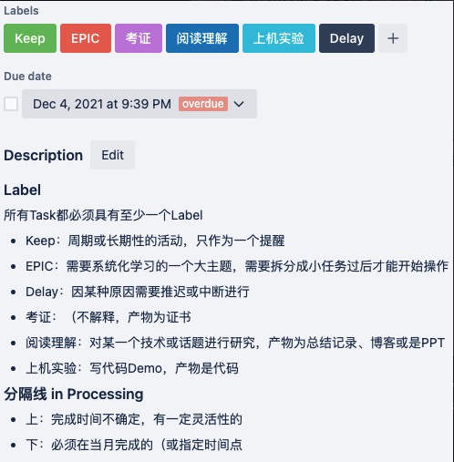
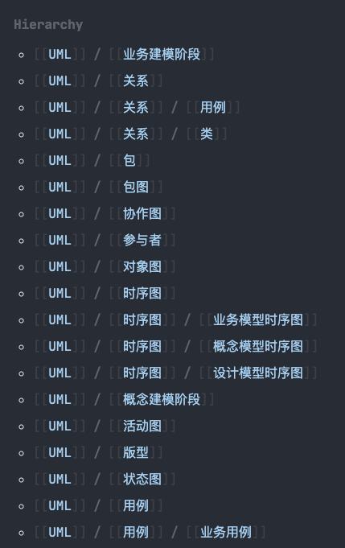
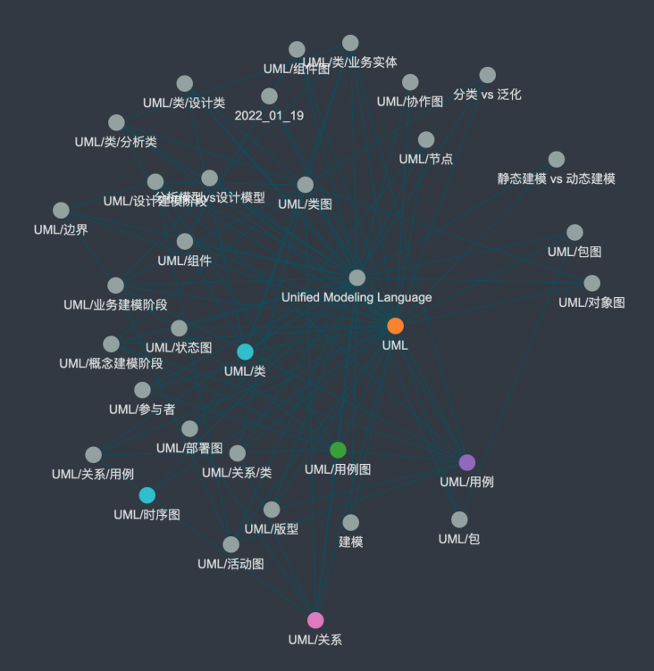

# Logseq - Build your own Wiki

# 前言

最近几年开始习惯用文字记录一些经历和感想，开始留意代码以外的叙述方式 - 绘图、文字、语音。也可能是年龄大了记不住太多事，也可能是（工作/社会）角色产生了变化，事情变多了。
在这个过程中切换了几次软件，终于在去年年底（21/12）注意到了[Logseq](https://logseq.com)，试用了一个月基本满足了我所有的需求。借此分享一些经验出来 ~ (已经安利给了不少周围的同事)

# 选型之旅

## 1.0 | Trello
  
- 目的：（项目外的）任务管理、目标追踪
- 用例：
  - 读书笔记，通过追加comments记录笔记（markdown）
  - 考证进度，标记deadline和注意事项
  - 待办事项，要做的事、要看的文章、要学的东西
- 不足：
  - 后期开始有一些中长期的规划，需要逐步拆分才能工作
  - 工作相关的任务也逐渐变多，需要记录（大脑内存不足）
  - 碎片化信息很多，Trello需要登录没法随时随地记录
  - 最后就是大大小小的任务堆积在Kanban，并不能有效的管理、执行任务，特别是需要拆分大任务的时候

## 2.0 | Trello + Reminders/Notes + Typora

- 目的：任务管理、目标追踪、OKR
- 用例：
  - 使用Tag和分割线来区分不同类型和优先级的任务
  - 使用Checklist+Attachment来关联O和KR，查看完成情况
  - 在Typora里用文件结构稍微区分了一下笔记内容
  - (Apple)Reminders/Notes，灵光一闪的时候（haha）就用手机记录，再通过Mac迁移



```markdown
 # Typora Folder Structure
 ----------------------------files
 0. README      : 如是说
 1. TODO        : 待办管理
 2. NOTEBOOK    : 随笔记事本

 ----------------------------folders
 _backup        : 备份数据
 _secrets       : `***********`
 documents      : 文档笔记，以markdown为主，自己所写
    _archive    : 已归档信息，如最终生成的pdf
 resources      : 资料文件，作为存档以备不时之需，来自外部
    _workspace  : 项目工作的文档，最好一段时间后删除
```

- 不足：
  - Typora很适合写文章，然而很难管理碎片化的笔记，很多时候我都要通过搜索找之前的笔记
  - 有时候要在多个软件间反复横跳，挺麻烦的
  - Trello用的企业版，Typora也收费了，考虑后续的迁移成本也挺麻烦的
  - 后来用Github Project替换了Trello，但是效果一般（治标不治本）

## 3.0 | Logseq

在[Dawei Ma的博客](https://www.bmpi.dev/)里看到了他的[人生管理系统](https://www.bmpi.dev/self/life-in-plain-text)，里面有关TODO、OKR、笔记的管理方式非常契合我的需求：All in One + Notes + Geek + RoamCult的工具。

随后通过Community、Twitter了解到了更多的RoamCult + GTD + Wiki工具，最后选择了Logseq作为新的笔记软件。

# Logseq Workflow

## 快速起步

知乎和B站已经有大量操作视频，可以通过他们的讲解快速入门。我这里直接分享我日常的用例，大家可以自行采用或修改

### 微信公众号读到一篇好文

- 搜集
  - 手机：微信转发好友给`Cubox收藏助手`
- 处理
  - 登录`Cubox.pro`，查看收藏的文章，复制/导出markdown到`Logseq`，删除收藏

> Cubox 是一个知识库，提供多端的接口：IOS/ChromePlugin/微信小助手(微信好友)，免费有200条，我只是把他作为中转站
> Cubox 还提供图片转文字，导出markdown

### 微信群内的讨论

- 搜集
  - 手机：微信转发好友给`Cubox收藏助手`

> 对没错，聊天信息也可以转发..。但是不能多条合并转发

### 知乎了解到一个新技术

- 手机：分享-更多-快速收藏至`Cubox`
- Chrome：
  - 右键-收藏网页/收藏内容至`Cubox`
  - `GoFullPage`截图

### 收到一封邮件(!!注意涉密信息)

- Chrome：
  - `GoFullPage`截图
  - `Markdownload`导出markdown

### medium读到一篇技术文章

- Chrome：
  - `GoFullPage`截图
  - `Markdownload`导出markdown

### 下载了一本PDF电子书

- MAC：拖进`Logseq`即可

> 拖进Logseq会在指定路径下创建一个副本，如果不想要这个副本，可以copy绝对路径，通过``在Logseq中引用已有文件
> 我还安装了`Goodnotes`，不过大多数时间都在Mac/iPhone上，使用频率很低(对Pad会比较友好)

### OKR完成20道Leetcode

- 我创建了一个模板，刷题之前先创建一个Page，然后写入模板，点击TODO开始计时
- 完成之后将分析过程和代码记录回来，结束TODO
- 在OKR内写了一个Query来查询完成了多少leetcode (其实通过 linked references 就知道做了多少了)

```markdown
- TODO #leetcode #OKR/2022/O1-JVM/KR1-Leetcode
  - 题目
    - abcdefg
  - 分析
    - 1
    - 2
    - 3
  - 代码
    - blaaaaaaaaaaaaa
```

### 准备下周的会议

- 在journey里创建`scheduled todo`，在tag页面记录agend或者meeting minutes

```markdown
* TODO have a meeting with [[@Anddd7]] #Project/X/2022-02-01
  SCHEDULED 2022-02-01
```

### 领到一张新卡 准备开工

- 在journey里创建`todo`

```markdown
* TODO refactor the workflow engine #Project/X/CARD-123456
  * tasking 1
  * tasking 2
  * tasking 3
```

### 进行新项目的技术选型和架构设计

- 创建`page`，`Project/X/Payment Solution`
- 可以使用`Logseq`内置的`/draw`
  - 也可以用:
    - 白板 - Excalidraw，drawio，Google drawing
    - 脑图 - ProcessOn、石墨
    - 设计图 - Penpot（开源）、Figma（收费）
    - 白板Sticker - Google Jamboard、Miro、Mural（收费）
    - as Code - PlantUML
    - Database - dbdiagram
    - CodeHighlight - carbon.now.sh

### 遇到优先级很高的Bug需要修复

- 在journey里创建`todo`，加上优先级和schedule和deadline

```markdown
* TODO [#A] refactor the workflow engine #Project/X/CARD-123456
  SCHEDULED xxxx-xx-xx
  DEADLINE xxxx-xx-xx
  * tasking 1
  * tasking 2
  * tasking 3
```

### 准备发布博客

- copy or export Logseq page，just 粘贴

> 我写了一个shell，输入文件名可以从logseq把文件copy到hexo路径下

### 回顾知识

- Flashcards!! 或者使用社区的插件 random notes，没事翻一翻之前的笔记
- 定期(周/月)的总结

## 小技巧

### 其他工具

Logseq主要做知识管理，但是如何高效高质量的获取原始数据，就需要其他工具的辅助了。我目前主要用的：

- 工具
  - Logseq：TODO、OKR、GTD、笔记、Insights、摘录、数据库、视图、表格
  - Visual Studio Code：编排笔记、书写博客
  - iCloud + Github：多端同步、备份数据
  - Cubox + MarkDownload：收藏文章、剪切信息
  - Goodnotes + 微信读书：读书（精读）
- 渠道
  - 推特 (真的不错，除了要翻墙之外)
  - 知乎 (一般般)
  - 微信公众号
  - 博客/邮件
  - 群聊天

### Hierarchy

当 page name 中包含`/`时，Logseq会将其分解为类似文件路径的结构，并生成hierarchy。而且在 graph 中也会有不同的着色，看起来更清晰。





### Query：GTD / OKR

通过Advanced Query查询 Page/Block，显示优先级较高的任务或内容，构建适合你自己的事务处理流。

- 正在做的任务

```clojure
#+BEGIN_QUERY
{   :title "🍖 Run~Run~Run"
    :query [:find (pull ?h [*])
            :where
            [?h :block/marker ?marker]
            [(contains? #{"NOW" "DOING"} ?marker)]]
    :result-transform (fn [result]
         (sort-by (fn [h]
                           (get h :block/priority "Z")) result))
    :collapsed? false}
#+END_QUERY
```

- 优先级较高或OKR相关的代办

```clojure
#+BEGIN_QUERY
{   :title "🏄 Nnnnnext"
    :query [:find (pull ?h [*])
            :where
            [?h :block/marker ?marker]
            [(contains? #{"NOW" "LATER" "TODO"} ?marker)]
            (not
             (not
                 [?h :block/priority ?priority]
            [(contains? #{"A" "B" "C"} ?priority)]
                )
                (not 
                 [?h :block/ref-pages ?p]
            [?p :page/name ?page-name]
            [(clojure.string/includes? ?page-name "okr")]
                )
            )]
    :result-transform (fn [result]
         (sort-by (fn [h]
                           (get h :block/priority "Z")) result))
    :collapsed? false}
#+END_QUERY
```


# 想法

Logseq的双链非常契合Mesh-Shaped的想法，我在使用Logseq进行工作/学习的时候也非常爽。知识可以相互链接扩展，计算机未必不能用哲学思考，UML也适用于团队管理。

在多个任务同时进行的时候，我也可以使用Journey + TODO(Query)随时"存档"然后切换到下一个任务。完成之后再切回来，通过记录的上下文快速回到之前的工作状态。

当然，Logseq本身只是一个工具，不一定适用每一个人。但找到一个契合你"思考方式"的工具，就能帮助你高效工作。
