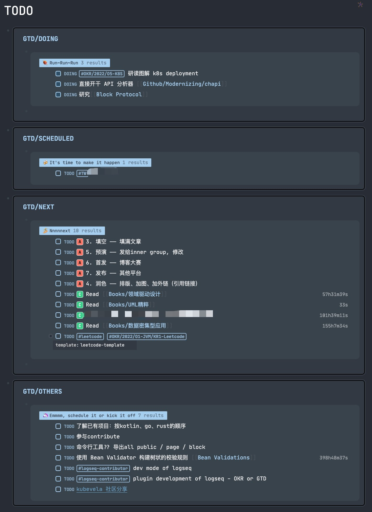

# Logseq 实现 TODO 列表

在前文基础上，介绍一下更贴近程序员的Logseq使用方式 —— Advanced Queries。

## TODO Query

我的TODO列表是按GTD的方式划分了4块：正在做、即将到期的、重要的、其他的

### GTD/DOING

```clojure
#+BEGIN_QUERY
{
	:title "🍖 Run~Run~Run"
    :query [:find (pull ?h [*])
            :where
            [?h :block/marker ?marker]
            [(contains? #{"NOW" "DOING"} ?marker)]]
    :result-transform (fn [result]
    					(sort-by (fn [h]
                        			(get h :block/priority "Z")) result))
    :collapsed? false}
#+END_QUERY
```

### GTD/SCHEDULED

```clojure
#+BEGIN_QUERY
{
	:title "🍻 It's time to make it happen"
    :query [
    	:find (pull ?h [*])
        :in $ ?start ?next
        :where
        [?h :block/marker ?marker]
        [(contains? #{"NOW" "LATER" "TODO"} ?marker)]
        (or [?h :block/scheduled ?d] [?h :block/deadline ?d])
        [(>= ?d ?start)]
        [(< ?d ?next)]
    ]
  	:inputs [:today :7d-after]
    :result-transform (fn [result]
    					(sort-by (fn [h]
                        			(get h :block/priority "Z")) result))
    :collapsed? false}
#+END_QUERY
```

### GTD/NEXT

```clojure
#+BEGIN_QUERY
{
	:title "🏄 Nnnnnext"
    :query [:find (pull ?h [*])
            :where
            [?h :block/marker ?marker]
            [(contains? #{"NOW" "LATER" "TODO"} ?marker)]
            (not
            	(not
                	[?h :block/priority ?priority]
	         		[(contains? #{"A" "B" "C"} ?priority)]
                )
                (not 
                	[?h :block/ref-pages ?p]
         			[?p :page/name ?page-name]
		         	[(clojure.string/includes? ?page-name "okr")]
                )
            )]
    :result-transform (fn [result]
    					(sort-by (fn [h]
                        			(get h :block/priority "Z")) result))
    :collapsed? false}
#+END_QUERY
```

### GTD/OTHERS

```clojure
#+BEGIN_QUERY
{
	:title "🦄 Emmmm, schedule it or kick it off"
    :query [
    	:find (pull ?h [*])
        :in $ ?start ?next
        :where
        [?h :block/marker ?marker]
        [(contains? #{"NOW" "LATER" "TODO"} ?marker)]
        (not
        	[?h :block/priority ?priority]
        	[(contains? #{"A" "B" "C"} ?priority)]
        )
        (not 
        	[?h :block/ref-pages ?p]
 	       	[?p :page/name ?page-name]
    	    [(clojure.string/includes? ?page-name "okr")]
        )
        (not
        	(or [?h :block/scheduled ?d] [?h :block/deadline ?d])
        	[(>= ?d ?start)]
        	[(< ?d ?next)]
        )
    ]
    :inputs [:today :3d-after]
    :result-transform (fn [result]
    					(sort-by (fn [h]
                        			(get h :block/priority "Z")) result))
    :collapsed? false}
#+END_QUERY
```

## CSS 加持

我使用的是Dev Theme, 但默认的样式会有一些问题（或者说我不太习惯）
- 代码块字体较小
- markdown table太窄，宽屏模式下还是会折行
- query table会有一个radio button切换模式，不过我不太常使用

在进行了亿点点🤏🏻（阅读源码）的研究之后，发现用css可能是最简单的解决方式...

```css
/* This must be the first line of the custom.css with other import rules */

/* 
	Anddd7's diy _
	checkout [https://logseq.com], create some sample blocks and check the classnames in browser
	copy and overwrite it here. (use !important if needed.)
*/

/* default font for literal */
:root {
  --ct-text-size: 16px;
  --ct-line-height: 1.6;
  --ls-font-family: "Only Emoji", "JetBrains Mono";
  --ct-page-title-font-family: var(--ls-font-family);
  --ct-code-font-family: "JetBrains Mono";
}

/* increase the font size of the code */
.CodeMirror pre.CodeMirror-line,
.CodeMirror-gutter,
.CodeMirror-gutters,
.CodeMirror-linenumber,
.CodeMirror-scroll,
.CodeMirror-sizer,
.CodeMirror {
  font-size: 14px;
  line-height: 18px;
}

/* expand markdown table for wide screen */
.table-wrapper {
  white-space: nowrap;
  max-width: 1400px !important;
}

/* hide useless things in customer query */
.custom-query .initial .align-items {
  display: none;
}
.custom-query .initial .content .block-content .timestamp,
.custom-query .initial .content .block-content .block-body {
  display: none;
}

/* styles changes */
.priority {
  margin-right: 8px !important;
}
```

### Output



# 总结

GTD（Get Things Done）是一个不错的工作框架，特别是在事情多且杂的时候。
> “切换页表，切换任务”，像CPU一样实现多核运行。
