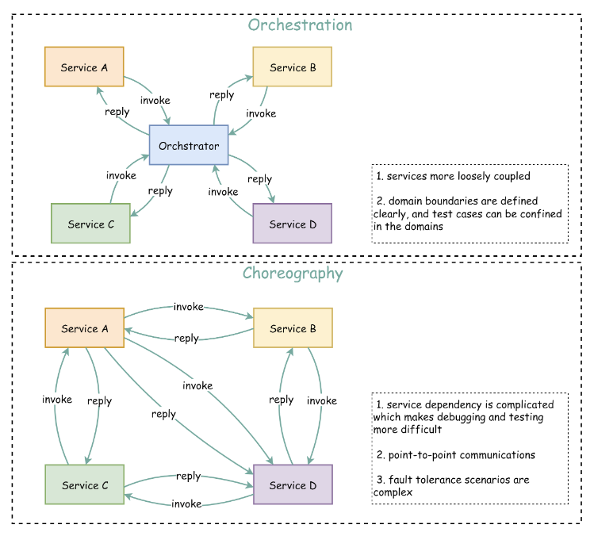

# Mesh-Shaped Retro

在过去的 2 个月，在 Logseq 的帮助下进行了一段时间“mesh”式的学习和探索。得到了一些新的知识，也遇到了不少的问题，借这个时间点回顾一下，希望能在下半年做的更好一些。

### Good achievements

- 阅读了 3 本书（粗读）
- 阅读了 40+ 篇 Blog/文档，100+篇笔记（长短不一）
- 整理并复习了 DDD、Cloud-Native 的知识图谱
- 持续的贡献开源代码

### Less well

- 一部分“碎片学习”是无效的
- 知识焦虑越来越重
- OKR 优先级和权重失真

## Why

在完成了规划已久的[“Mesh-Shaped”](/2022/03/29/Mesh-Shaped-Cloud-Native-Developer/)设定之后，这一宏大愿景给了我非常强的信心和动力投身到 “mesh” 式的学习中。借助 Logseq 等工具，我把所关注的公众号、参与的技术群群、关注的社交网络中的大佬，都安排进了我的“knowledge pipeline” —— 通过摘抄、截图、总结把这些知识收集了起来。从编程语言的 tips、到云原生的发展前景、到架构模式的建立、到开源商业的市场逻辑，随着时间的推移，涉及的知识域越来越广。

然而，随着知识域扩展到我不熟悉的领域，并不能通过简单的摘抄就能够理解它。我需要搜索更多的资料，了解更多的背景，而学习的重点也逐渐的偏移了我的 OKR。在我花了整整 3 天时间，才完成了预计 10h 的 GCP ML Fundamental 的学习后，我发现想要学习一个全新的领域，需要的时间、精力是另一个量级的（超出预计），也是很难用碎片化时间去填充的。比如，ML Models 和相关的算法，需要一个非常集中思考的时间，才能够真正学懂的知识。

### 一部分“碎片学习”是无效的

因此，回顾我过去 2 个月的学习时，不少的知识都是碎片且无效的。（包括加入了很多社区群，just 加入）

碎片式学习很适合查漏补缺，比如，在对 DDD 和面向对象有一定了解的前提下，通过参加社区活动和查阅博客，对我以前不理解或有疏漏的概念进行了补充和深入。或者是对于一个具体的问题的调查和研究。

而我收集到的很多“碎片”，只是放在那里，希望我能在它“过气”之前用上它。

### 知识焦虑越来越重

不加限制的阅读导致我的知识焦虑越来越重。什么都想知道，什么都要了解 —— 这并不好。

### OKR 优先级和权重失真

碎片化的学习叠加起来，反而占据了大量的时间，导致 OKR 里的主线任务迟迟没有进展。而且在执行 OKR 时，我也试图用碎片化的方式去做 —— 今天做这个明天看那个，实现了 OKR 的“并发”，然而我并没有多个“线程”来执行他们，最后的后果就是抢占式调度 —— 更慢了。

## 总结

发散很重要，我们需要拓宽眼界和思路，以实现 “曲线救国” 或是 “降维打击”。聚焦也同等重要，保证路不走偏，积蓄力量攻坚克难。

前两天和同事交流“Orchestration vs Choreography”时，有聊到：
> Choreography 是 mesh 式的调用，其实是因为服务间相互不可知。即 Complex（Cynefin）的认知模式下，大家都是黑盒，因此只能依赖相邻的服务一步一步传递信息，实现业务的最终执行
> Orchestration 则是由中心的指挥家总揽全局。因为整个系统对他而言处于 Clear 模式，需要谁做什么、谁先谁后，都心中有数。

反观“Mesh-Shaped”，并不是说所有知识一定是要相互连接，奔着扩大范围走的。而是以点绘面 —— 通过已有的核心点，逐步扩散出新的领域，从而构建更大的范围知识网。

