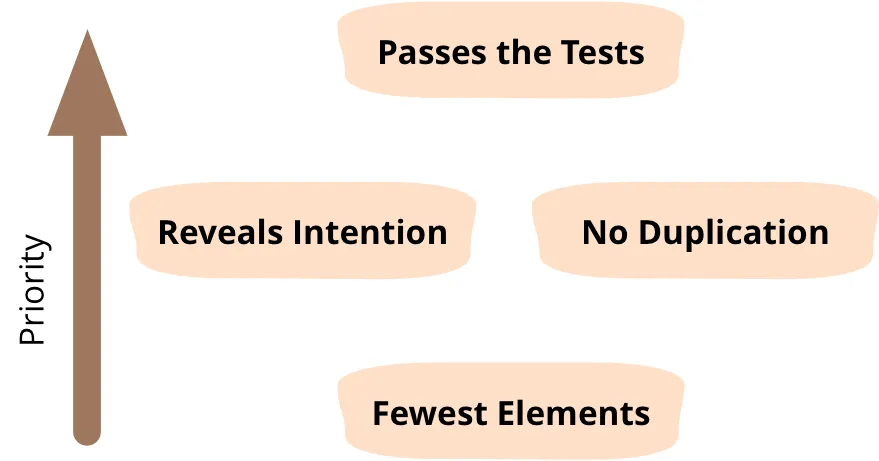
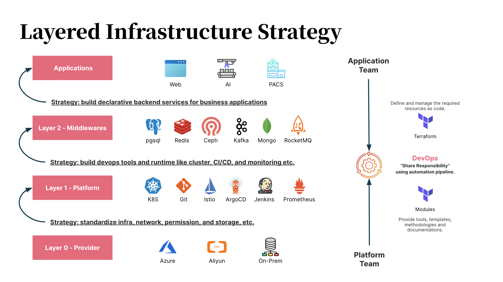

# Thoughts and Practices on Infrastructure as Code (IaC)

## Immutable Infrastructure

Before talking about IaC, let's first understand immutable infrastructure:

> **Software application complexity -> Development and deployment complexity -> Infrastructure complexity**

In the past software development, in order to configure and install the operating environment of the software application, it usually takes a lot of time to prepare the network, machine, operating system and database. And as the software is updated, the operating environment will also be adjusted, such as installing patches, modifying ip, modifying ports, etc. However, manual adjustments are not only prone to errors, but also difficult to record modifications. This operating environment (server) is like a pet you care for carefully. Once lost, it will never be found again.

Therefore, the industry has put forward the metaphor of [Pet vs Cattle](https://joachim8675309.medium.com/devops-concepts-pets-vs-cattle-2380b5aab313), and verified its effectiveness through cloud services.

Similarly, snowflake servers and phoenix servers describe similar situations: each snowflake is unique, and once it melts, it can never be condensed into the same snowflake again. The phoenix server can be reborn through "egg" nirvana (the characteristics of the phoenix server):

- Stable server status and fewer deployment failures
- No configuration drift or snowflake server
- Consistent pre-release environment and simple horizontal scaling
- Simple rollback and recovery processing

And to solve the above problems (to achieve immutable infrastructure):

- Automated pipeline
- Stateless application layer
- Persistent data layer
- Infrastructure as Code IaC
- DevOps style collaboration

IaC is not only an important part of them, but also a tool that can easier to achieve the other goals using the advantages of code.

> IMMUTABLE, BUT CONFIGURABLE / REPRODUCIBLE AND AUTOMATABLE

## 'AS' code, not 'IS' code


There are many tools for IaC, and even using shell, python to call cloud service sdk, cli can also complete efficient infrastructure orchestration. But the focus of the infrastructure 'as' code is not entirely on code - 'AS' not 'IS'.

On the one hand, use code to manage infrastructure:

- Improve efficiency based on programming/template language
  - Variables, constants, functions, improve coding efficiency and reduce duplication and input errors
  - Abstraction, encapsulation, reuse, assist in the creation, modification and distribution of infrastructure
  - Code structure is the infrastructure architecture
  - The code is self-explanatory, just like Clean Code
- Improve efficiency based on code tools
  - Git, help infrastructure achieve versioning
  - Test, check the reliability of infrastructure as early as possible
  - Pipeline, automated testing, deployment, verification, rollback, faster response

On the other hand, IaC should be committed to 'describing' infrastructure:

- Infrastructure is affected by hardware architecture and has inherent dependencies and limitations
  - For example, vm, cluster needs to be built on the network
  - For example, db, mq are regional resources, and dns is a global resource
- Although the code runs very fast, the preparation of the infrastructure is not as fast as the cloud provider said "in seconds"
  - The startup of java and go applications is in seconds
  - While the "deployment" time of infrastructure varies from a few minutes to several hours
  - For example, Alibaba Cloud RDS takes nearly 10 minutes to be fully available
- If you encounter a stateful service, the difficulty of rebuilding is much greater than that of database migration

### Simple Design in IaC


[four rules of Simple Design - Kent Beck](https://www.martinfowler.com/bliki/BeckDesignRules.html)
[Clean Code — 4 Rules of Simple Design](https://medium.com/swlh/clean-code-4-rules-of-simple-design-f86b066ee43d)

The design and implementation process of IaC can also use the theory of simple design:

- Passes the test, it must be the first condition to be met
- Reveals intention
  - Use declarative programming to describe the types, models and resource dependencies of infrastructure with code
  - "Do one thing and do it well" - UNIX design philosophy
    - eg. make, man, tree ...
- No duplication
  - Use module, template, script to abstract reusable resources or commands
    - eg. module, template, script ...
- Fewest elements - Less is more

### Layered architecture in IaC



Layered infrastructure is similar to layered architecture (eg. mvc), that is used to separate focus point:

- Owner
  - What the organization is? How many departments are there? How many stackholders are there?
  - What are their roles and responsibilities?
  - What's the collaboration model?
- Change frequency
  - What resources need to be prepared and designed from the beginning?
  - What resources are needed to start a new service?
  - Which ones cannot be modified? Which ones are revised regularly? Which ones are subject to change at any time?
- Resource Type
  - IaaS/PaaS/SaaS
  - Computing, storage, network, cluster, middleware, tool chain

As shown above, it is a sample of layered architecture, if you want to "Build a k8s cluster based on a multi-cloud environment".

- Layer0 and Layer1 are committed to abstracting the same support platform in different cloud environments and exposing encapsulated interfaces.
- Layer2 builds an internal middleware/service "market" within the enterprise and provides a variety of components for on-demand use.
- Application "use" on demand, until a service is adopted by the application team, it will be deployed through automated scripts


Then, we can process it via gitops.


## Terraform Tips

Based on the above theory, we take terraform as an example (deploying a service including front-end and back-end) to introduce some tips:

### Simple application: no layer, just execute it

```sh
  simple
  └── main.tf
```

### Simple application - Classify: need to manage the resource by group

```sh
  simple-by-resource/
  ├── database.tf
  ├── oss.tf
  ├── vm.tf
  └── vpc.tf
```

```sh
  simple-by-application/
  ├── backend-app.tf
  └── frontend-app.tf
```

### Simple application - Modulization: abstract, reuse by module

```sh
  simple-with-modules/
  ├── applications
  │   ├── backend-app
  │   │   └── main.tf
  │   └── frontend-app
  │       └── main.tf
  └── modules
      ├── database
      │   └── main.tf
      ├── oss
      │   └── main.tf
      └── vm
          ├── main.tf
          └── vpc.tf
```

### Complex application - Sub module: use folder to build hierarchy

```sh
  complex-sub-modules/
  ├── applications
  │   ├── backend-app
  │   │   └── main.tf
  │   └── frontend-app
  │       └── main.tf
  └── modules
      ├── database
      │   ├── main.tf
      │   └── v1
      │       ├── main.tf
      │       └── security-policy.tf
      ├── oss
      │   └── main.tf
      └── vm
          ├── main.tf
          └── networking
              └── main.tf
```

```terraform
  # complex-sub-modules/applications/banckend-app/main.tf
  module "server" {
    source = "../../modules/vm"

    cpu    = 2
    memory = 4096
    vpc_id = module.vpc.id
  }

  module "vpc" {
    source = "../../modules/vm/networking"

    type = "private"
    cdir = "172.0.0.1/16"
  }

  module "db" {
    source = "../../modules/database"

    # upgrade to v1
    # source = "../../modules/database/v1"

    # or publish module to registry
    # source = "private-regirstry@modules/database/v1"
  }
```

### Complex application - Environment: extract environment-related variables, and distinguish based on environment

```sh
  complex-env-apps/
  ├── applications
  │   ├── backend-app
  │   │   ├── env
  │   │   │   ├── dev.tfvars
  │   │   │   ├── prod.tfvars
  │   │   │   ├── qa.tfvars
  │   │   │   └── stg.tfvars
  │   │   ├── main.tf
  │   │   └── variables.tf
  │   └── frontend-app
  │       ├── env
  │       │   ├── dev.tfvars
  │       │   ├── prod.tfvars
  │       │   ├── qa.tfvars
  │       │   └── stg.tfvars
  │       ├── main.tf
  │       └── variables.tf
  └── modules
      ├── database
      │   └── main.tf
      ├── oss
      │   └── main.tf
      └── vm
          ├── main.tf
          └── vpc.tf
```

```sh
  # manage env vars in a separate folder, and treat applications as a module
  complex-outside-env-apps/
    ├── applications
    │   ├── backend-app
    │   │   ├── main.tf
    │   │   └── variables.tf
    │   └── frontend-app
    │       ├── main.tf
    │       └── variables.tf
    ├── env
    │   ├── common.yaml
    │   ├── dev.tfvars
    │   ├── prod.tfvars
    │   ├── qa.tfvars
    │   └── stg.tfvars
    └── modules
        ├── database
        │   └── main.tf
        ├── oss
        │   └── main.tf
        └── vm
            ├── main.tf
            └── vpc.tf
```

```sh
  # for global deployment, add region layer on top of environment
  complex-region-env-apps/
  ├── applications
  │   ├── backend-app
  │   │   ├── main.tf
  │   │   └── variables.tf
  │   └── frontend-app
  │       ├── main.tf
  │       └── variables.tf
  ├── modules
  │   ├── database
  │   │   └── main.tf
  │   ├── oss
  │   │   └── main.tf
  │   └── vm
  │       ├── main.tf
  │       └── vpc.tf
  └── vars
      ├── cn-chengdu
      │   ├── dev.tfvars
      │   ├── prod.tfvars
      │   ├── qa.tfvars
      │   └── stg.tfvars
      ├── cn-shanghai
      │   ├── dev.tfvars
      │   ├── prod.tfvars
      │   ├── qa.tfvars
      │   └── stg.tfvars
      ├── common.yaml
      ├── eu-west4
      │   ├── dev.tfvars
      │   ├── prod.tfvars
      │   ├── qa.tfvars
      │   └── stg.tfvars
      └── sg
          ├── dev.tfvars
          ├── prod.tfvars
          ├── qa.tfvars
          └── stg.tfvars
```

### Advanced application - Share State: access state of other module

```terraform
  # query by remote state
  data "terraform_remote_state" "backend_state" {
    backend = "oss"

    config = {
      bucket = "tf_tutorial_remote_state_bucket"
      key    = "dev/applications/backend-app/terraform.tfstate"
      region = "cn-shanghai"
    }
  }

  locals {
    backend_port = data.terraform_remote_state.backend_state.outputs.port
  }
```

```sh
  # combine applications, merge all infrastructure into a tree, and manage them from the root node
  advance-compose-state/
  ├── applications
  │   ├── backend-app
  │   │   ├── main.tf
  │   │   └── variables.tf
  │   ├── composed
  │   │   └── main.tf
  │   └── frontend-app
  │       ├── main.tf
  │       └── variables.tf
  ├── modules
  │   ├── database
  │   │   └── main.tf
  │   ├── oss
  │   │   └── main.tf
  │   └── vm
  │       ├── main.tf
  │       └── vpc.tf
  └── vars
      ├── cn-chengdu
      │   ├── dev.tfvars
      │   ├── prod.tfvars
      │   ├── qa.tfvars
      │   └── stg.tfvars
      ├── cn-shanghai
      │   ├── dev.tfvars
      │   ├── prod.tfvars
      │   ├── qa.tfvars
      │   └── stg.tfvars
      ├── common.yaml
      ├── eu-west4
      │   ├── dev.tfvars
      │   ├── prod.tfvars
      │   ├── qa.tfvars
      │   └── stg.tfvars
      └── sg
          ├── dev.tfvars
          ├── prod.tfvars
          ├── qa.tfvars
          └── stg.tfvars
```

Print the outputs of one module into a file, and then read the file in another module

```terraform
  # write outputs to file
  output "port" {
    value = module.server.port

    depends_on = [module.server]
  }

  provisioner "local-exec" {
    command = "echo ${module.server.port} > port.txt"
  }
```

```terraform
  # read outputs from file
  data "local_file" "port" {
    filename = "${path.module}/port.txt"
  }

  locals {
    port = data.local_file.port.content
  }
```

Use Terragrunt to facilitate the remote state query 


### Advanced application - Layered achitecture and Platform

```sh
  advance-platform/
  ├── layer0
  │   ├── alicloud
  │   │   ├── nonprod
  │   │   │   └── main.tf
  │   │   └── prod
  │   │       └── main.tf
  │   └── aws
  │       ├── nonprod
  │       │   └── main.tf
  │       └── prod
  │           └── main.tf
  ├── layer1
  │   ├── modules
  │   │   ├── compute
  │   │   │   └── main.tf
  │   │   ├── network
  │   │   │   └── main.tf
  │   │   └── storage
  │   │       └── main.tf
  │   ├── platform
  │   │   └── main.tf
  │   └── vars
  │       ├── cn-chengdu
  │       │   ├── dev.tfvars
  │       │   ├── prod.tfvars
  │       │   ├── qa.tfvars
  │       │   └── stg.tfvars
  │       ├── cn-shanghai
  │       │   ├── dev.tfvars
  │       │   ├── prod.tfvars
  │       │   ├── qa.tfvars
  │       │   └── stg.tfvars
  │       ├── common.yaml
  │       ├── eu-west4
  │       │   ├── dev.tfvars
  │       │   ├── prod.tfvars
  │       │   ├── qa.tfvars
  │       │   └── stg.tfvars
  │       └── sg
  │           ├── dev.tfvars
  │           ├── prod.tfvars
  │           ├── qa.tfvars
  │           └── stg.tfvars
  └── layer2
      ├── applications
      │   ├── backend-app
      │   │   ├── main.tf
      │   │   └── variables.tf
      │   └── frontend-app
      │       ├── main.tf
      │       └── variables.tf
      ├── modules
      │   ├── database
      │   │   └── main.tf
      │   ├── oss
      │   │   └── main.tf
      │   └── vm
      │       ├── main.tf
      │       └── vpc.tf
      └── vars
          ├── cn-chengdu
          │   ├── dev.tfvars
          │   ├── prod.tfvars
          │   ├── qa.tfvars
          │   └── stg.tfvars
          ├── cn-shanghai
          │   ├── dev.tfvars
          │   ├── prod.tfvars
          │   ├── qa.tfvars
          │   └── stg.tfvars
          ├── common.yaml
          ├── eu-west4
          │   ├── dev.tfvars
          │   ├── prod.tfvars
          │   ├── qa.tfvars
          │   └── stg.tfvars
          └── sg
              ├── dev.tfvars
              ├── prod.tfvars
              ├── qa.tfvars
              └── stg.tfvars
```
