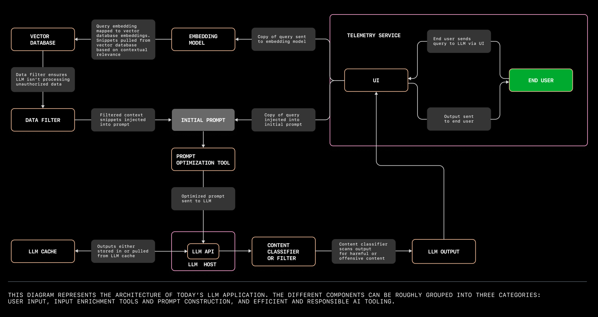

# 逐步完善的 LLM 应用架构

在过去的一年，AIGC 的浪一波又一波的拍向了各个行业，各种的应用和项目也如雨后春笋般涌现。经过一年多的迭代，底层模型的质量和数量都得到的极大的提升，特别是开源模型的迭代速度更是快的让人吃惊。中上层的框架和应用也发展迅猛，像是 Langchain、ollama 这样的项目，降低了构建 LLM 应用的门槛也提升开发的速度。

我也是最近发现了 ollama 这样一个工具，从而开始了对 LLM 应用开发的探索。

## LLM 架构演进

一开始受限于上下文 token 的限制，大家只能通过一些简单的提示和上下文来使用 LLM 模型。比如，给定一些上下文信息或是给 AI 设定一些角色和任务，然后让 AI 继续下文。这样的应用虽然简单，但是也能够满足一些简单的需求。


> - chrome prompt 收藏夹: <https://github.com/Anddd7/poc-aigc/blob/main/chrome/image.png>
> - langchain prompt template: <https://github.com/Anddd7/poc-aigc/blob/main/langchain/index.ipynb>

而模型的知识域受限于训练数据，是无法实时更新的。如果你询问一些最新的信息，模型是无法给出正确的答案的，然后胡言乱语 —— 幻觉。当然，你可以将这些补充信息作为 context 传入模型，但是这样的做法是不够灵活的，且无法处理较大的文本或是 pdf/word 等格式的文档。

向量化 —— 将补充信息转化为向量，然后拼接到上下文中。相比文字，向量化的标识符会更容易被 LLM 处理，并且消耗 Token 更少。


> - logseq markdown index query: <https://github.com/Anddd7/llm-logseq-reader/blob/main/example/Starter.ipynb>

随着使用规模的增加，更大的上下文、更多的用户和更高的使用频率，社区又引入了数据库和 cache 来存储和管理上下文信息。就像传统应用的开发一样，数据库能够对向量数据进行存储管理和相关性查询，能够最大程度保证在有限长度下，上下文输入数据的准确性。cache 一是缓存已经回答过的相关问题减少模型调用频次，二是存储历史问答数据作为上下文补充，避免“失忆”。


## LLM 应用开发和部署



> [The architecture of today’s LLM applications](https://github.blog/2023-10-30-the-architecture-of-todays-llm-applications/)

从常规的应用开发的角度来看，LLM 就是一个 UI/Server/DB 的老三层架构，只不过部署和运行 LLM 需要一大堆的依赖会相对复杂一些。

而 ollama 这个工具则提供了非常方便的接口，通过 cli 命令就可以直接调用多个模型，还能通过 http api 进行调用。

```sh
# 对于熟悉 docker 命令的同学来说，这个 cli 就更加简洁易懂了 ...
Available Commands:
  serve       Start ollama
  create      Create a model from a Modelfile
  show        Show information for a model
  run         Run a model
  pull        Pull a model from a registry
  push        Push a model to a registry
  list        List models
  cp          Copy a model
  rm          Remove a model
  help        Help about any command
```

因此在有了 ollama 之后，我们就可以直接使用 ollama 来调用模型，而不需要再自己搭建一套服务了。Langchain 则毫无疑问是 Orchestration 的第一选择。


> [Building LLM-Powered Web Apps with Client-Side Technology](https://ollama.com/blog/building-llm-powered-web-apps)

### [Sample](https://github.com/Anddd7/poc-aigc/blob/main/ollama)
