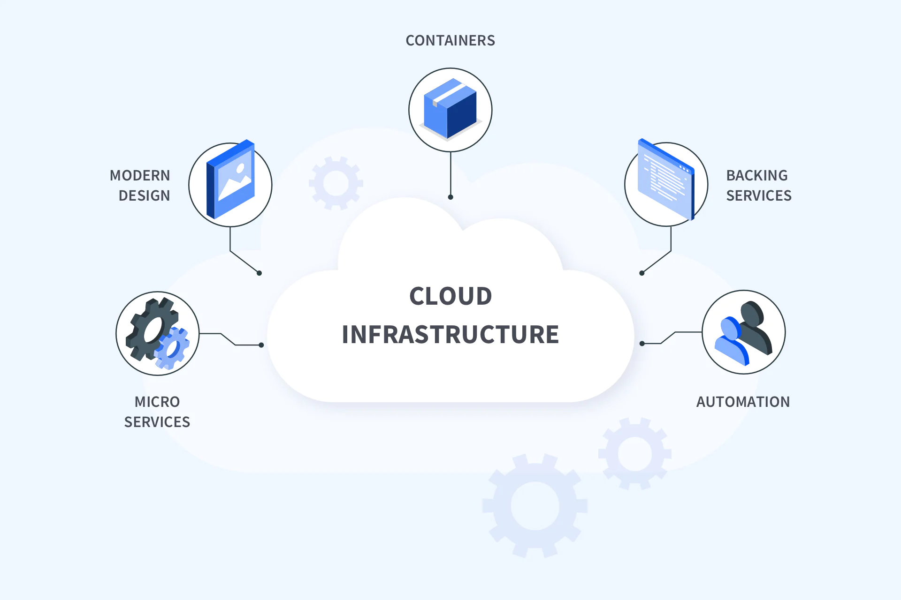
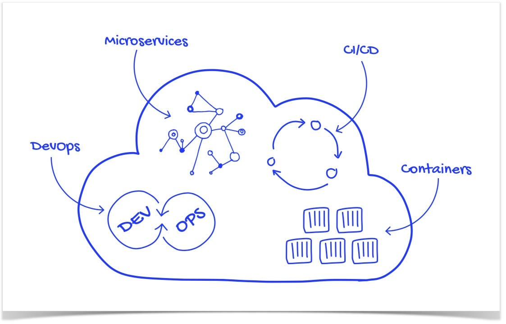
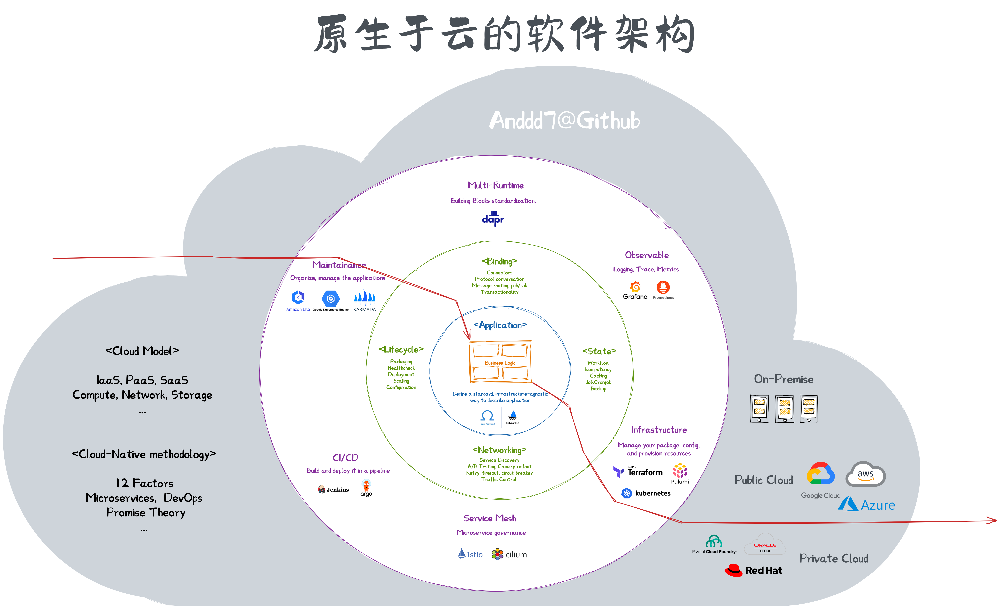

# 实现云原生：从技术创新到工程落地

| 版本 | 修改                   | 时间    |
| ---- | ---------------------- | ------- |
| v0.1 | 脑洞                   | 2022-11 |
| v0.2 | 大纲                   | 2023-05 |
| v0.3 | 大纲重构，主要章节划分 | 2023-08 |

## 引言

在当今快速变化的数字化时代，云原生已经成为企业实现敏捷、创新和可扩展性的关键策略。随着市场竞争的日益激烈，传统的软件开发和部署方式已经无法满足迅速变化的业务需求。云原生作为一种全新的方法论和技术范式，旨在通过将应用程序和基础架构无缝结合，使组织能够更快速地交付软件、更高效地响应市场变化，并在不断演化的环境中保持竞争优势。

“降本增效” —— 是企业上云的主要目标之一，也是企业数字化转型的重要驱动力。得益于云计算、DevOps、微服务架构、自动化运维等技术的发展，云原生技术围绕 “构建**容错性好**、**易于管理**和**便于观察**的松耦合系统。结合可靠的**自动化**手段，能够轻松地作出**频繁**和**可预测**的重大变更。” 这一目标，为企业提供了一系列的软件开发理论、实践方法和中间件工具。

然而，要真正实现降本增效，仅仅关注技术的创新是无法达成的。云原生强调的松耦合、弹性扩展、自动化等原则，不仅需要开发运维的紧密合作（DevOps），引入高效的工具和系统，业务部门也需要积极参与其中（BizDevOps），以敏捷的、快速的方式传递并交付业务价值。因此，落地云原生不是要堆砌技术工具，而是需要**建立新的工程体系，结合思维方式和组织文化的变革**，实现团队的高效协作、快速交付和持续创新。

本文将探讨如何构建云原生的工程体系，如建立标准化能力、明确职责划分、推动组织文化变革，以帮助不同阶段的企业落地云原生。

> （免责声明叠甲）本文所述内容仅代表作者个人的观点，供参考但不对最终实践结果负责。

### 目标

- 云原生工程化体系 PoV
- 企业落地云原生的 Runbook
- 可供参考的组织演进路线，包括组织结构、流程和关键能力
- 可供参考的关键能力项，包括技术工具、理论知识、实践方法
- ...

### 受众

- 技术负责人：关注划分团队职责、组织结构和培养人员能力
- 架构师：关注技术选型和架构设计
- 运维：关注关键能力
- 开发：关注关键能力
- ...

### 适用场景

- 企业上云、企业下云
- 降本增效、自动化、DevOps、FinOps
- 平台团队价值呈现
- ...

## 第一章：云原生工程

> PoV 云原生的下一个阶段是建立系统化方法，在资源有限的情况下通过合理的规划、设计和管理，实现预期目标 —— 工程化

### 什么是工程

工程（化）是指将某种系统的、可重复的方法应用于特定领域或任务，以提升效率、质量和可维护性。工程化关注过程、规范、标准化、自动化和持续改进，以确保产品在各个阶段都能保证高质量。工程思想包括：解决复杂问题并构建高效的解决方案，将问题分解为更小的组成部分，制定明确的流程和步骤，利用数据和分析来支持决策，以及持续改进。例如：

- 制造业：制造业依赖工程方法来设计和制造产品，包括流程优化、质量控制和成本效益的考虑。
- 航空航天工程：在设计、构建和测试航空航天器时，工程思想至关重要，因为安全性和可靠性是最高优先事项。
- 建筑工程：建筑行业涉及大规模的工程项目，工程化方法用于规划、设计、施工和维护建筑物和基础设施。
- 能源和环境工程：解决能源供应和环境问题需要综合的工程方法，考虑资源利用、环境影响和可持续性。
- 软件工程：软件系统变得越发复杂而庞大，也需要建立对应的工程方法，以确保软件应用的质量、可维护性和可扩展性。
  - [在大学学科划分中，5204070 软件工程也是计算机众多分支中的一门独立学科](https://www.zhihu.com/question/24292554)。
  - 软件工程是关于构建和维护大规模软件系统的一门学科。
    - 它注重通过规范的过程、方法和工具来管理软件开发项目，以确保软件按照预期的质量、时间和成本要求完成。
    - 它强调团队协作、项目管理、质量保证和软件生命周期管理等多个方面。
    - 它的目标是在现实环境中开发出可靠、高质量、易维护的软件，同时关注了软件的可扩展性、可维护性和鲁棒性。

技术的发展和工程的建立是螺旋上升的，一项技术的创新通常包括很多的前提和假设，在进入实际生产时可能会遇到很多问题，例如：

1. **不稳定性和不可靠性**：缺乏系统性测试的创新的技术可能存在不稳定性和不可靠性。
2. **缺乏可维护性**：工程通常要求产品具备必要的文档、规范和标准，有助于保持系统的可维护性。
3. **风险管理困难**：工程通常要求进行风险评估和管理的流程。缺乏这些方法可能导致对潜在风险的忽视，从而可能在未来出现意外问题。
4. **项目管理挑战**：缺乏系统化管理可能导致项目管理困难，包括进度延误、资源浪费和沟通混乱。
5. **不符合法规和标准**：在某些行业中，遵循特定法规和标准是必要的。

尽管创新的技术是推动进步的关键，但缺乏工程方法可能导致技术的不稳定性、不可维护性和风险增加。工程方法可以帮助确保技术的有效实施、稳定性和可持续性，从而在创新的基础上构建可靠的系统和解决方案。

### 什么是云原生工程

在过去的几年，云原生技术高速发展，各种新的技术和工具层出不穷 [CNCF Landscape](https://landscape.cncf.io/)，但是在实际的落地过程中，很多企业都遇到了各种各样的问题，比如：

- 云原生工具太多，不知道如何选择
- 技术体系不成熟，缺乏标准化能力
- 团队成员能力不足，无法快速上手
- 流程不清晰，无法有效的协作
- 技术侧难以阐述价值，无法获得业务部门的支持
- 成本不降反升，无法实现降本增效
- ...

这些云原生技术和工具是为了解决已经被深入理解、经过抽象的问题而设计的。它们通过强调容器化、自动化、弹性扩展等原则，能够更高效地应对这些问题，提供了更灵活、可扩展且易于管理的解决方案。然而，对于复杂问题而言，除了使用技术和采购工具并不总是足够，更需要配合系统性的方法和综合的工程实践。

**复杂问题没有简单解**，在引入解决方案之前需要对问题域进行深入的分析和定义，确保清晰地理解问题的本质和挑战。企业中的复杂问题通常涉及多个层面的因素，涵盖技术、流程、组织和文化等各个方面。那么，建立一个完整的**云原生工程体系**，能够引导问题的深入分析和细致拆解，从而形成更切实可行的解决方案。最后再选择并应用相关的云原生技术，就能够有效提升云原生的效率，最终将其成功应用于实际落地。

**云原生工程体系**即一套系统性、标准化的方法和指南，为企业上云、DevOps、研发提效等活动提供指导。它涵盖了从问题定义、团队划分、系统设计、开发、测试到持续改进等各个环节的方方面面，以协调、管理和优化各种资源和活动。

以下，我会借助**价值流图**来阐述云原生工程体系的构建过程，以及如何将其应用于实际的落地。

## 第二章：落地云原生的关键要素

价值流图
指标设计
- 活动 = 问题分析
  - 子活动
  - 子活动
- 参与方 = 团队/组织
- 能力
  - 工具
- 价值流的推进

演进
- 价值流的变化（步骤变化）

### 标准化能力

> 需要思考出一个合理的能力分层，更面向实现、可操作层面的
>
> 云原生模型：API + 微服务 + devops ...
> DI 模型(infra): IaC + ... + ...
> DPS 模型：API + DI + ...

- 制定技术标准和最佳实践
- 统一的容器镜像管理
- 基础设施即代码（Infrastructure as Code）

### 职责划分与团队组织

devops team topologies

- [The Art of Platform Thinking | Thoughtworks](https://www.thoughtworks.com/insights/blog/art-platform-thinking)

平台工程

- 根据 Atlassian 的说法，“平台团队创建可以由众多流程对齐的 [产品] 团队使用的功能，减少了流程对齐 [产品] 团队的资源和认知负荷…… 平台团队可以创建跨不同用户体验或产品的连贯体验。”
- 根据 Martin Fowler 和 Evan Bottcher 的说法，“数字平台是一个自助式 API、工具、服务、知识和支持基础，按照一个引人注目的内部产品的方式组织。自治交付团队可以利用该平台以更高的速度交付产品功能，并减少协调。”
- [CNCF 平台白皮书发布](https://mp.weixin.qq.com/s/z6i09qkCaoI79gH4O70skA)
- <https://tag-app-delivery.cncf.io/whitepapers/platforms/>

- 重新定义角色和组织
  - role 角色
    - cloudops, devops, sre
  - 组织
    - 产品型
    - 项目型
    - 中台
    - ...
  - 演进方向
    - ...

- 制定云原生团队的角色和职责
- 跨部门协作和沟通
- DevOps文化的培养

### 组织演进与文化变革

标准化能力 —— 基本模块
组织结构 —— 蓝图（将标准化能力分配给不同的角色和团队）
流程 —— 使能和连接点（将组织调动起来，实现目标）

一个组织有计划、有规模的采用某种能力，以实现组织的某种目标，这就是工程。

- Dev（研发团队）- DevOps（赋能团队） - SRE（平台团队） - Ops（云平台）

演进

- 小团队： | 4. DevOps as an External Service ，将 Ops 托管出去，通过插件化、服务化来运维产品
- 中型团队： | 6. DevOps Advocacy Team 随着组织扩大，Dev 和 Ops 的内容变的更多，DevOps 不再只关注当前产品，会需要考虑运维的特殊需求
- 大型团队： | 7. SRE Team 随着组织进一步扩大，运维的产品越来越多，通过建立 SRE 团队来为组织建立统一的标准和工具链；DevOps 不再需要和 Ops 直接接触，而是使用 SRE 为组织量身打造的产品和“服务”
    collapsed:: true

- SRE = CloudOps，DevOps = 平台工程, Ops = 云平台/基础设施
  - SRE 提供统一的工作流程和工具链
  - Dev 通过使用这些预制工具来实现 DevOps

- {:height 643, :width 542}
  - case 1 ...
    - 处于某个阶段的组织，具有 ... 的特性
    - 我们应采取 ... 等能力，以应对 ... 变化（当前阶段为什么需要这些能力，可以完成什么样的工作）
    - 当组织演进到 case x 时，我们应准备 ... （对演进方向的阐述，加上需要扩展的能力）
  - case 2 ...
    - ...

- 从传统架构到云原生的演进阶段
- 重塑组织文化，促进敏捷和创新

## 第三章：演进路线和案例分析

- pov
  - 以组织规模为主线
  - 10 25 50 99 中小型团队 ds omj payme
  - 100 150 250 大型团队 payme ds 南粤
  - 299+ 超大型团队 亚信
- 每一条线都有：标准组织 行业特征
  - 目标 方向 难点
  - 人员 能力
- 工具，价值流图和4r1

### 价值呈现

如何通过云原生工程化，实现价值的呈现

- 为什么要上云
- 为什么要下云

- 内部云平台团队如何发展？
- 平台团队并不拥有资源（归属于数据中心），只是封装了一些接口
- 出了问题后，不好定位（会首先 target 到平台团队，但可能 rootcause 在数据中心）
- 如何有效的获取业务团队的需求，然后持续的演进

回答的都是一个价值问题，在不同的组织、不同的阶段，需要解决的问题和提供的价值是不同的
这也是云原生化最难的一个点，只是采购几个工具，或者买几个云产品是解决不了问题的
因此也没有一个适合所有公司所有行业的上云方案

通过上述 能力 x 组织 的阐述，我们可以

- 分析：当前的组织处于什么阶段；当前的团队具备哪些能力；组织的下一个阶段是什么，面对的问题是什么，需要具备哪些能力才能解决这些问题
- 设计：如何调整组织结构，如何培养团队能力，如何选择工具和技术
- 计划：时间线、参与方、资源投入
- 实施：迭代式演进 + 评估效果 + 调整计划
- 总结：总结经验，形成最佳实践
- 迁移：将经验迁移到另一个组织继续实施，或者迁移到另一个阶段

### 行业案例分享：企业X的云原生之旅

- 企业X的背景和挑战
- 云原生引入的具体技术和策略
- 实施过程中的经验教训和收获

### 成功的关键因素总结

- 从实践案例中总结的成功因素
- 如何在不同组织阶段应用这些因素

## 完结篇：云原生下一站

### 云原生技术的未来发展方向

- 新兴技术和趋势展望
- 对云原生从业者的技能要求

### 面向未来的建议

- 如何持续推动云原生落地和发展
- 培养人才，促进知识分享和交流

## 附录

### 参考资料

- ChatGPT
- <https://martinfowler.com/articles/talk-about-platforms.html>
- <https://www.zhihu.com/question/24292554>