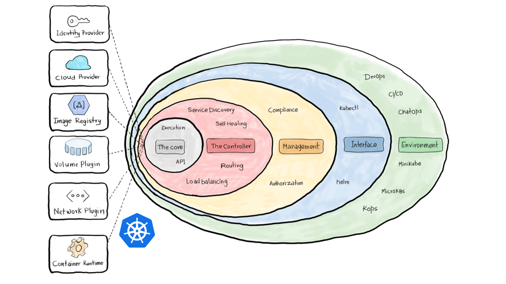
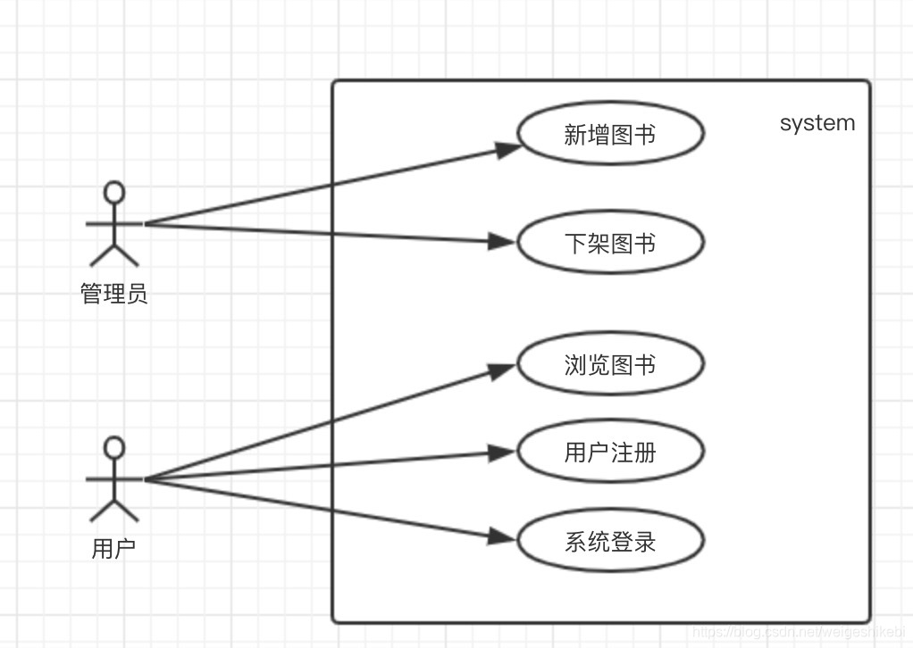
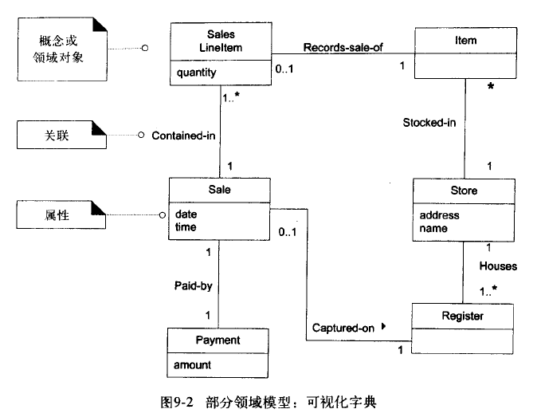
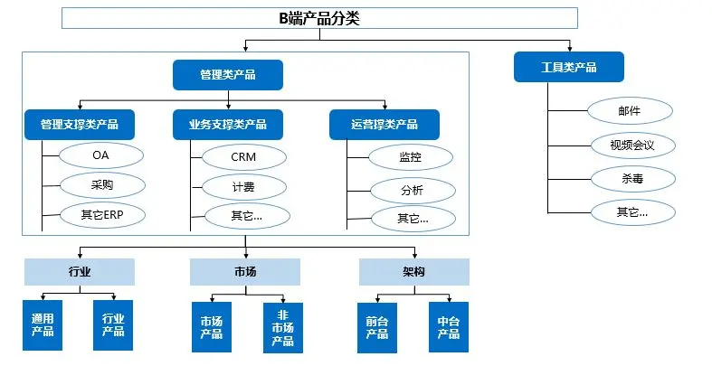
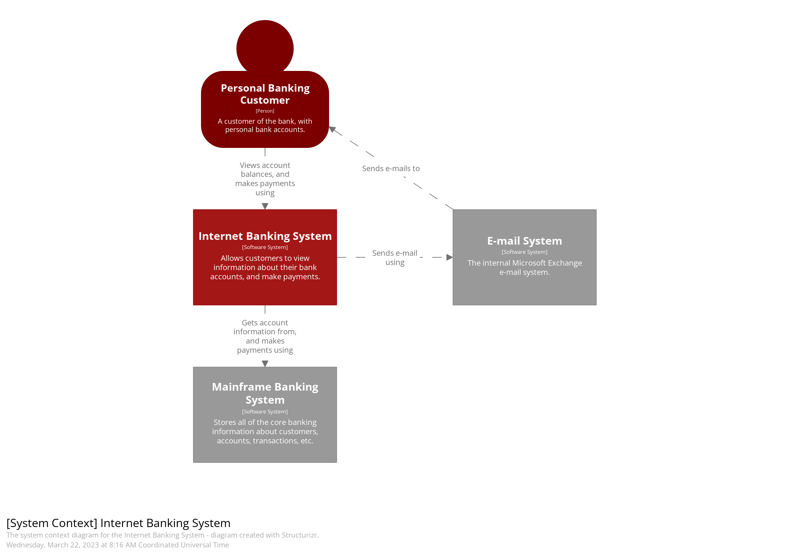
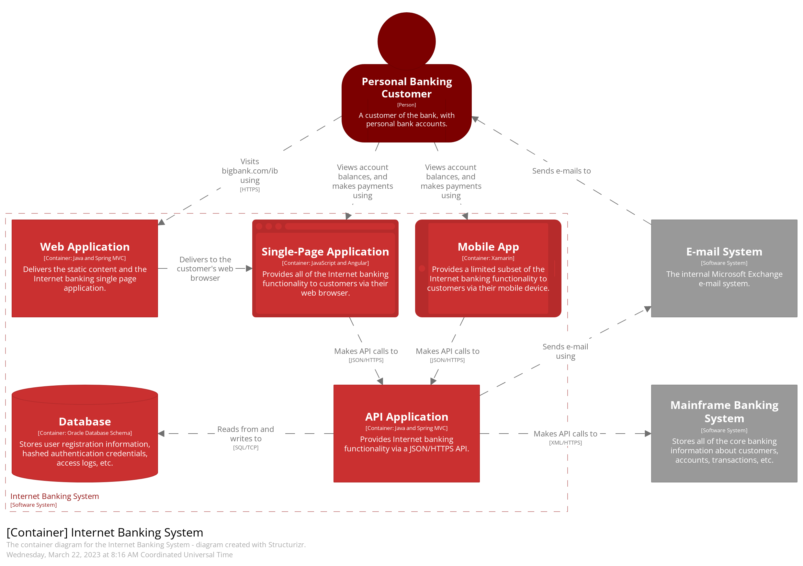
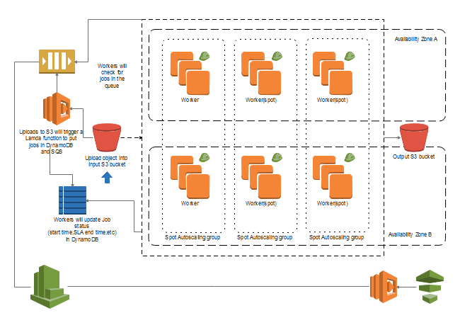
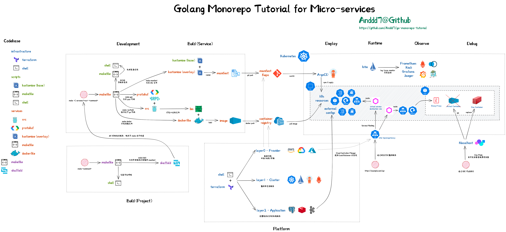
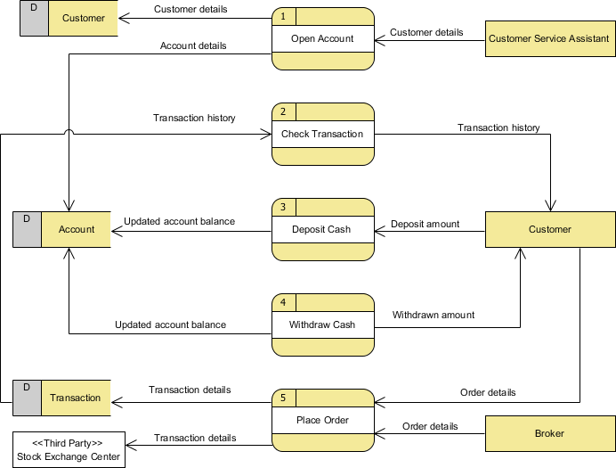
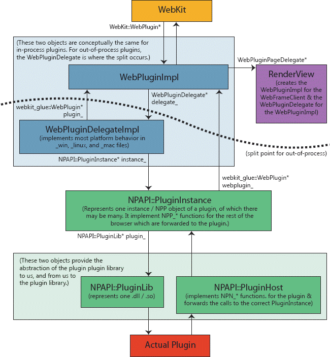

# 架构图怎么画

### 架构视图（案例）

将 “信息主体”  进行 “结构层次分解” + ”逻辑关系组织” + ”风格” 展示给 “利益相关方”

但对于一个复杂的软件系统，可能需要向多个不同的利益相关者绘制不同目的的架构图，以满足不同的需求。就像是建筑设计中的平面图、立面图、剖面图等，每个视图都有自己的特点和表达方式。我们将这样一系列的具有明确职责的架构图称为架构视图（Architecture View）。

比如，

- UML 包含了多种类型的架构图，如类图、对象图、组件图、部署图、活动图、时序图等。
- C4 模型则包含了系统的上下文视图、容器视图、组件视图和代码视图等。
- “4+1” 提出了逻辑视图、过程视图、物理视图、开发视图和场景视图。通过多个相互关联的架构图，对软件系统进行不同维度的描述。

因此，绘制架构图时除了要设计单张架构图的内容和结构，还要考虑单张架构图的信息边界，避免一张图表达过多的信息，导致信息过载。同时，如果采用多张架构图来描述系统，还要考虑多张架构图之间的关系和一致性，以确保整体的完整性和连贯性。

> 以下笔者基于 4+1 视图将个人常用的架构分为以下几种视图，并给出部分示例，仅供参考

#### 概念视图

概念图的作者 Joseph D. Novak 对于概念的定义是：用一个特定的符号表示的感知到的关于对象或事件或其记录的规律或模式。其核心要素包括：

- 概念 —— 概念对象和描述
- 关系 —— 由指向性的箭头 + 文字标注来表示
- 焦点 —— 这一组概念表达了什么信息？这一组关系解决了什么样的问题？

属于概念视图的有：

##### 业务领域图

核心：业务范围（领域和边界），以便了解产品愿景、规划资源和调整团队

受众：CEO CTO

##### 用例图

核心：描述用例和场景，帮助理解和对齐业务流程

受众：PO Architect

##### 领域模型图

核心：领域模型，帮助理解业务系统的设计
受众：PO Dev

#### 模块视图

概念视图通常是抽象的，用于展示整体情况，大部分时候都是问题域 —— 即我们想解决什么样的问题。
而模块视图关注的则是解决方案域 —— 即我们如何解决问题：我们要设计什么样的系统、这个系统具有哪些模块，才能解决这样的问题。

##### 系统支撑图

核心：呈现为一个矩阵，描述系统如何承载概念视图中的业务领域和用例

受众：CTO Architect

##### C4-System

核心：描述用户和系统间的关系，理清系统的使用方和使用场景

受众：CTO Architect

##### C4-Container

核心：进程间架构，定义协议和交互方式，以便系统间实现良好的集成

受众：Architect Dev

#### 执行视图

根据模块视图，我们已经可以开始进行系统的开发了。但对于一些特殊的应用，除了应用团队开发的服务外，还使用了大量的中间件、云服务等。
在模块设计时，它们可能表现为某一个服务/系统的一部分。但在部署时，DevOps 团队可能会将它们独立部署，甚至可能会将它们部署在不同的地区，以提高系统的可用性和性能。
而在执行阶段，运维团队也会特别关注这些节点，保证整体系统的稳定性和可用性。

##### 部署架构图

核心：部署形态，包括网络拓扑、CICD、CR 流程、运维特征

受众：Architect DevOps

##### Value-Stream 价值流图

核心：交付物的流转

受众：Architect Dev

##### 数据流图

核心：关键数据的变化路径，以及数据的来源和去向

受众：Architect Dev

#### 实现视图

在做实现的时候，可能受技术栈、业务逻辑的复杂程度影响，我们在代码层级也会做一些设计，比如分层架构、读写分离、事件驱动等。

##### C4-Component

核心：进程内架构、技术栈、核心 feature 的设计

受众: Dev

#### **备注

以上视图作用在不同的层级 —— 即向不同的受众角色传达特定话题的信息。因此在一些垂直领域（技术的、业务的），部分视图可以省略。架构图并不是一定要面面俱到，只是一个传递信息的工具而已。

如，中间件领域，业务领域图可无/弱化
如，大数据领域，在实现视图内，相比代码架构更关注数据模型
