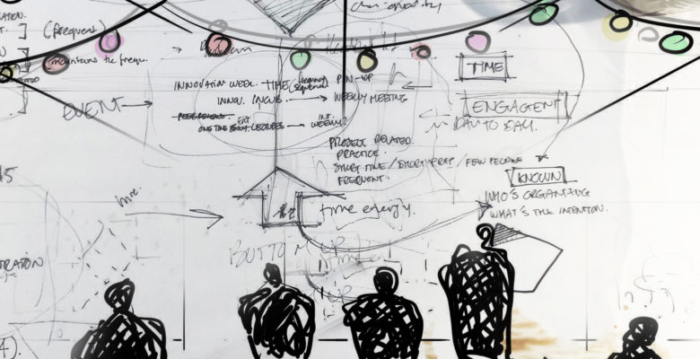
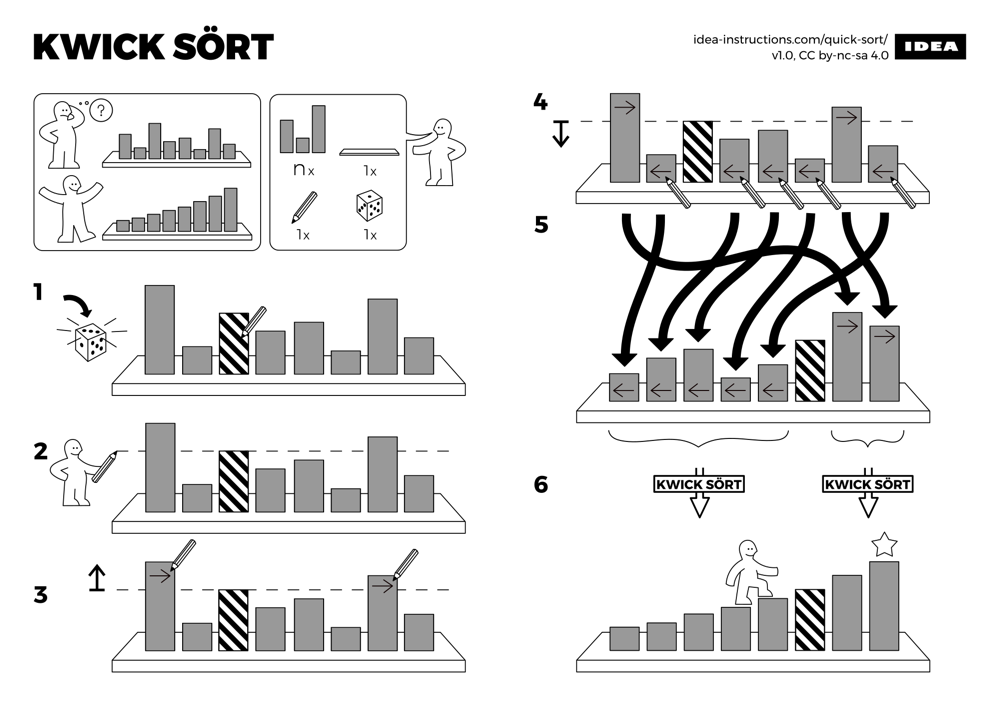

# 架构图怎么画

| **@Version** |           1.0.0 |
| :----------- | --------------: |
| **@Author**  | Anddd7, ChatGPT |

- [架构图怎么画](#架构图怎么画)
  - [前言](#前言)
    - [目标受众](#目标受众)
  - [文字、图形和可视化表达](#文字图形和可视化表达)
    - [语言与文字](#语言与文字)
    - [图形（图象、图像）](#图形图象图像)
    - [可视化表达](#可视化表达)
      - [可视化符号](#可视化符号)
      - [表现形式](#表现形式)
      - [图的表现力](#图的表现力)
  - [软件架构图的构成](#软件架构图的构成)
    - [关注点设立](#关注点设立)
      - [利益相关方](#利益相关方)
      - [信息主体](#信息主体)
    - [绘制技巧](#绘制技巧)
      - [结构层次分解](#结构层次分解)
      - [逻辑关系组织](#逻辑关系组织)
      - [风格和风格指南](#风格和风格指南)
      - [工具](#工具)
  - [图解工作法](#图解工作法)
    - [步骤](#步骤)
      - [复现](#复现)
      - [发散](#发散)
      - [收敛](#收敛)
      - [重组](#重组)
    - [实践(案例)](#实践案例)
  - [参考](#参考)

## 前言

在软件开发领域，架构图是一种强大的工具，用于描述系统设计时的逻辑结构。类似于建筑设计中的建筑图纸，架构图可以帮助软件开发人员更好地理解和沟通系统的整体设计，从而促进团队合作和项目的成功实施。

**建筑设计图**
在建筑设计中，建筑师会使用建筑设计图来表达建筑物的结构、布局和各个部分之间的关系。并且根据使用场景不同，还可以细分为多种类型，如平面图、立面图、剖面图等。
类似地，以架构图作为载体，可以帮助软件开发人员从不同的维度理解系统设计，并以此进行跨团队的沟通和协作。通过类比建筑设计图，我们也可以参考建筑设计图的绘制方法来绘制架构图。

**图形的表现力**
软件系统通常复杂且庞大，包含多个组件、模块和交互关系。在这种复杂性下，仅依靠文字描述很难准确传达系统的结构和设计意图。架构图以图形化、可视化的方式，更直观、更易于理解，从而降低沟通成本、信息损耗，提升团队效率。

**多重价值**
架构图可以作为文档的一部分，可以帮助开发人员记录和沉淀系统设计的思路和决策。
架构图还可以作为团队协作的工具，帮助不同角色的成员更好地理解和参与系统的开发过程。
架构图还可以用于与项目利益相关者（如客户、管理层）的沟通，以便更好地展示系统的整体架构、技术方案和价值呈现。

### 目标受众

本文的受众群体主要是从事软件开发的人，包括但不限于以下人员：

- 软件开发工程师：这些人员负责具体的软件开发工作，包括编写代码、设计系统结构等。他们可以使用架构图来帮助他们理解系统的整体设计和组织，更好地进行模块化和组件化开发，以及解决系统中的问题和优化。
- 系统架构师：系统架构师负责系统的整体设计和架构规划。他们可以使用架构图来表达他们的设计意图和决策，与团队成员和利益相关者进行沟通和共享。架构图可以帮助他们在系统设计过程中权衡不同的技术方案和决策，并为系统的发展和演进提供指导。
- 项目经理：项目经理负责项目的规划、协调和管理。他们可以使用架构图来理解系统的整体结构和组织，帮助他们更好地把握项目的进展和风险，以及与团队成员和客户进行沟通和协调。
- 技术顾问和解决方案架构师：技术顾问和解决方案架构师为客户提供技术咨询和解决方案设计。他们可以使用架构图来与客户共享和演示他们的设计方案，帮助客户理解系统的整体结构和技术实现，并为客户做出决策提供支持。

这些从事软件开发的人员在日常工作中会有多种使用场景，包括但不限于以下情况：

- 系统设计和规划阶段：在系统设计和规划阶段，他们可以使用架构图来理解和描述系统的整体结构、模块和组件的关系，以及数据流和交互流程等。
- 团队协作和沟通：架构图可以作为团队内部沟通和协作的工具，帮助团队成员之间更好地理解和讨论系统设计，减少误解和沟通障碍。
- 文档编写和知识传承：架构图可以作为文档的一部分，帮助记录和传承系统设计的思路和决策。它们可以作为技术文档、系统文档或用户手册的一部分，为开发人员和利益相关者提供系统的概览和详细信息。
- 技术展示和客户沟通：架构图可以用于分析和描绘当前系统的情况，也可以用于展示和演示未来系统的设计方案。

本文旨在为上述场景下的架构图绘制提供一些有用的指导和建议，包括对基本图形的介绍、架构图的关注点设立、绘制技巧等。并基于业界实践和笔者个人经验，总结了一些常见的架构图类型和使用场景。

## 文字、图形和可视化表达

在人类的历史中，文字和图形（绘画）一直是人们表达思想和传播信息的主要方式，它们各有优势，可以用于不同的场景和目的。通过理解和比较文字和图形表达方式的区别，我们可以更好的绘制出富含信息又易于理解的图。

### 语言与文字

语言是人类交流和表达思想的最常用的一种工具，它通过语音符号来传递意义。语言的起源可以追溯到早期人类通过声音和手势进行基本交流的时期。随着人类智慧的发展，语言逐渐演化成为复杂的符号系统，用于表示事物（识物）、概念（辩理）甚至是抽象思维（哲学、宗教）。

文字是语言的可视化形式，用于通过抽象的符号记录和传播信息。文字的发展是为了解决语言的时间和空间限制，使得信息可以被保存、传递和阅读，超越了口头传述的限制。

语言和文字对人类文明的影响深远。它们不仅成为了人类思想和知识的媒介，还推动了人类社会的发展和进步。

当涉及到使用语言或文字表达时，有几个限制和特征：

- 表现力有限：文字主要通过字词和句子的组合来传达意义，但它们可能无法准确地捕捉复杂的概念、情感和感觉。有时候，一些抽象的或非具象的概念可能需要通过其他手段来进行解释和传达。
- 线性表达：文字的表达方式是线性的，即按照左至右、上至下的顺序逐个表达和解读。在大部分文字书写系统中，如英语、汉语等，阅读方式是从左至右。这可能对信息的传达和组织方式产生一定的影响，因为在一段文字中，前面的内容可能会影响后续内容的理解。同时也限制了同时传达多个概念或信息的能力。
- 依赖人脑处理：文字的理解依赖于人脑的分析、记忆和总结能力。读者需要通过解读和组织文字，将其转化为有意义的概念和思维模型。这可能涉及词汇理解、语法解析、上下文推断和知识联想等认知过程。不同的人具有不同的认知能力和知识背景，因此对相同文字的理解可能存在差异。
- 上下文负载：文字的理解通常依赖于上下文的负载。同样的文字，在不同的上下文中可能具有不同的含义和解读。读者需要综合考虑文字本身的表述以及所处的背景信息、语境和前后关系等因素，以理解文字的真正意义。

### 图形（图象、图像）

（这里不讨论图形、图像的定义和区别，“图”都泛指通过一个或多个图形构成的简单的、复杂的图像）

图形是通过线条、形状、点和颜色等基本要素构成的平面或立体的视觉表达。它们可以是简单的几何形状，也可以是复杂的图案和图像，用于传达和表达特定的概念、思想或信息，具有艺术性、装饰性或功能性的目的。

当涉及到图的“阅读”时，有以下几个优势和特点：

- 非线性阅读：相比于文字的线性阅读方式，图的阅读是非线性的。图中的元素可以在不同的位置和角度上呈现，并且读者可以根据自己的需要选择性地关注不同的部分。这种非线性的特性使得读者可以自由地浏览和理解图中的信息，以适应自己的思维方式和需求。
- 依赖视觉能力：图的阅读依赖于人脑的视觉能力。读者需要观察、分析和解释图中的形状、线条、颜色等视觉元素，并将它们转化为有意义的概念和关系。这涉及到识别模式、寻找关联、进行空间推理等视觉认知过程。视觉能力对于理解和解读图中的信息至关重要。
- 数理逻辑表达：在图论和拓扑学中使用图来表达数学逻辑，是因为图提供了一种直观、可视化的方式来描述和分析对象之间的关系和结构。图的数理逻辑表达能力使得它们可以用于描述和分析复杂的关系和结构，如网络拓扑、数据流、组织结构等。

### 可视化表达

图形通过视觉元素来传达信息，其表现力取决于组成这个图形的元素的数量和种类，比如点、线、面、体、颜色、材质等。通过一个或多个图形的组合，可以表达更多的信息，如空间关系、时间关系、逻辑关系等。

#### 可视化符号

从广义的概念，一个图形包含的信息主要包括几何属性和非几何属性：

- 几何属性：刻画对象的轮廓、形状。也称几何要素。包括点、线、面、体。
- 非几何属性：视觉属性，刻画对象的颜色、材质等。比如明暗、色彩、纹理、透明性、线型、线宽。

图的绘制本质上仍是对信息的抽象化表达，即符号化。无论是几何属性中的点、线、面，还是非几何属性中的颜色、纹理、明暗等，都是用来表达某一种信息的符号。

**几何属性**

- 点：点是最基本的几何属性，通常用来表示一个位置或一个数据点。点和点的相对位置，则反应了数据间的亲疏关系。在数据可视化中，点经常被用来表示离散的数据项，如散点图中的数据点，或地图上的地理位置。

- 线：线是由两个或多个点连接而成的几何形状。线可以用来表示各种关系和连接，如连接两个点之间的路径、表示数据的趋势或流动。在图表中，线经常用于绘制折线图、曲线图等。
  - 箭头
  - 折线
  - 曲线

- 面：面是由多个线段或曲线围成的闭合区域，具有面积和形状。面常用来表示数据的分布、范围或区域。在地图中，面被用来表示地理区域、行政区域或统计区域。
  - 方框
  - 圆
  - 多边形

- 体：体是由多个面围成的立体形状，具有体积和形状。体通常用来表示物体的形状和空间位置。在建筑设计中，体被用来表示建筑物的结构和布局。
  - 立方体
  - 圆柱体
  - 圆锥体
  - 球体

（在更大的坐标系上，面、体又会坍缩成一个点，形成新的图形关系）

**非几何属性**

- 颜色：颜色是非常重要的属性，可以用来表达数据的不同类别、特征或重要程度。因为人眼对不同颜色的敏感度不同，选用合适的颜色可以帮助读者更好地理解和记忆信息。例如，使用红色表示紧急的信息，使用绿色表示正常的信息。
- 纹理：纹理是通过斑点、线条、图案或阴影等视觉效果来增加图形的细节和复杂性。纹理可以用来表示表面的质地、模式或特征。如虚线表示虚拟的边界，阴影表示物体的凹凸表面。
- 明暗：明暗是指图形的亮度和对比度。通过调整明暗，可以增加图形的视觉效果和对比度，用来突出显示某些部分或强调关键信息。如将前景物体调亮，将背景物体调暗，可以使前景物体更加突出。
- 透明度：透明度是指图形元素的透明程度。透明度可以用来表示数据的密度、重叠关系或深度。可以在二维图形中表现三维效果。
- 线宽：线宽指线条的粗细程度。线宽可以用来表示数据的强度、关联的强弱或表示图形元素的重要性。比如，使用粗线条表示主要的数据传输路径，使用细线条表示次要的数据传输路径。

#### 表现形式

通常我们会有以下几种图形的可视化表达形式：

- 二维：二维可视化是最基本的形式，通过平面上的点、线和面来表达信息。
  - 几何属性包括点的位置、线的长度和方向、面的形状和大小。非几何属性包括色彩、线宽、纹理、透明度、明暗等。通过合理运用这些属性，可以在二维平面上创造出丰富的图形效果。
  - 例如，使用不同颜色的点表示不同类别的数据，使用线条的粗细和纹理来表示数据的趋势或关系，使用不同明暗程度的面来表示数据的密度或权重。

- 二点五维：二点五维可视化是在二维平面上叠加多个图像形成图层。
  - 每一层的图像可以表示不同的信息。这种可视化表达形式常用于地图、图表和数据可视化中。
  - 例如，在地图上叠加不同的图层，可以同时展示某一个地区的地理特征、人口数据和气候状况，以便更全面地了解地区的情况。

- 三维：三维可视化通过在三维空间中表达信息，即 xyz 三坐标系。
  - 几何属性不仅包括点、线和面，还包括深度、体积和角度。通过调整物体在三维空间中的位置、大小和形状，可以展示更多的空间关系和视角。
  - 非几何属性也同样适用于三维可视化，例如使用色彩和光照效果来模拟阴影和反射。三维可视化广泛应用于建筑设计、虚拟现实、游戏开发等领域。

- 四维：四维可视化是指通过动画来记录和展示图形的变化。
  - 在时间维度上，通过连续的图形演变，可以呈现数据的变化趋势和演化过程。这种形式的可视化特别适用于展示时间序列数据和动态系统。
  - 例如，使用折线图或曲线图展示随时间变化的数据趋势，或者通过动画展示物体的运动轨迹和变形过程。

#### 图的表现力

图可以在一个相对小的空间中表达大量的信息，因而图传达信息的能力（表现力）远远超过了文字。

- 直观性：图形能够以直观的方式呈现信息，通过形状、颜色和位置等视觉元素传达信息，使人们更容易理解和记忆。相比之下，文字需要经过阅读和解释才能理解其含义。
- 综合性：图形可以在一个整体中呈现大量的信息，将复杂的概念和关系以一种清晰的方式展示出来。这有助于整合不同的观点和元素，帮助读者建立全局的认知和理解。
- 语义化：图形可以使用符号、图标和形状等视觉元素来表示特定的含义，从而实现语义化的表达。这样一来，读者可以通过视觉上的关联性来理解不同元素之间的关系，而无需依赖繁琐的文字解释。
- 空间表达：图形在空间上的布局和组织可以传达信息的层次结构和重要性。通过在图形中使用不同的位置、大小和层次，可以强调某些元素的重要性，帮助读者更好地理解和记忆信息。
- 跨文化性：图形在语言和文化之间具有更广泛的适应性。由于图形是基于视觉元素的，因此它们可以跨越语言障碍，使得信息在不同文化和语境中都能得到理解和传达。

但图和文字本质上都是抽象的符号化的，同样会遇到理解差异、上下文负载等问题。抽象程度越高，需要理解当前图像的上下文和背景知识就越多，因此作者不但要琢磨绘制的图形元素是否能够表达自己的想法，还要考虑读者是否具备足够的知识和能力来理解图形的含义。

## 软件架构图的构成

软件架构图是用于描述和展示软件系统的结构、组件以及它们之间的关系的图形表示。它提供了一个高级视图，帮助软件开发人员和利益相关者理解系统的整体设计和组织方式。在软件开发领域，常见的架构图类型包括：系统架构图、软件架构图、部署架构图、数据流程图、时序图等。

### 关注点设立

不论是哪种类型的架构图，它们的本质都是用来传递信息。为了高效地传达信息，绘制架构图时首先要明确目标受众群体和信息主体，即“向谁传达什么信息”。不同的受众可能对系统的不同方面有不同的关注点，因此在设计架构图时需要根据受众的角色和需求，选择合适的表现方式和细节层次。

#### 利益相关方

| 角色       | 关注点                                                       |
| :--------- | :----------------------------------------------------------- |
| 业务人员   | 主要关注业务模块、业务流程和系统边界等                       |
| 开发人员   | 主要关注系统的组件、模块和接口等                             |
| 系统管理员 | 主要关注系统的部署、运行和监控等                             |
| 架构师     | 主要关注系统的整体设计、问题和优化方向，以及未来的演进规划等 |
| 项目经理   | 主要关注系统的边界，团队资源和成本                           |
| CxO        | 主要关注业务领域、组织结构的映射                             |

#### 信息主体

| 主体       | 描述                                             |
| :--------- | :----------------------------------------------- |
| 业务领域   | 比如，销售、采购、库存、财务等                   |
| 业务用例   | 比如，采购领域中的采购申请、采购订单、采购入库等 |
| 系统       | 比如，采购系统、库存系统、财务系统等             |
| 系统模块   | 比如，采购系统中的支付模块、订单模块等           |
| 基础设施   | 比如，服务器、网络、数据库等                     |
| 进程间架构 | 比如，系统模块间的调用关系、数据流等             |
| 进程内架构 | 比如，系统模块内的接口、包、分层等               |

以上分类仅做参考，无论是用图还是文字来描述架构，都无法脱离团队和项目上下文。因此，绘制架构图时根据具体的项目和团队，明确好利益相关方和信息主体，选择熟悉和易懂的方式来绘制架构图即可。

### 绘制技巧

#### 结构层次分解

- 分解系统：将系统分解为不同的层次或模块，从整体到细节逐步展开。首先，确定系统的高层结构，然后根据功能、责任或领域进行更细致的划分，形成层次化的模块结构。

- 使用容器：使用容器作为整体架构图的顶层元素，代表系统的不同部分或模块。容器可以是逻辑上独立的组件、子系统、服务或模块。每个容器代表一个层次，可以进一步展开其内部结构。

- 显式化层次：在架构图中使用适当的符号或连接方式来表示不同层次之间的关系。可以使用包含关系、嵌套关系、连接线等方式，清晰地展示模块之间的层次结构和依赖关系。

- 展示模块的职责和功能：在每个层次的模块中，明确展示其职责和功能。可以使用标签、注释或简短的描述来说明每个模块的作用和职责。

- 根据功能或责任进行分组：将相关的组件或模块按照其功能或责任进行分组，并将它们放置在相近的位置。这样做可以帮助读者快速理解不同组件之间的关系和依赖。

- 避免过度细节：在绘制结构层次时，要避免陷入过度细节的陷阱。保持适度的抽象和概括，着重展示系统的整体结构和关系，而不是过多关注每个细节。

#### 逻辑关系组织

- 使用合适的布局：选择适合的布局方式来组织和排列组件和模块。常见的布局方式包括层次布局、流程图布局、网格布局等。选择合适的布局方式可以使架构图更具可读性和美观性。

- 显示依赖关系：使用适当的符号或线条来表示组件之间的依赖关系。可以使用箭头、线条或连接线来表示模块之间的消息传递、调用关系、数据流等。这样可以清晰地展示组件之间的依赖关系，并帮助读者理解系统的工作流程。

- 考虑流程和数据流：如果系统中存在明确的流程或数据流，可以在架构图中展示这些流程或数据流的路径和关系。这样可以更好地展示系统的逻辑流程和数据流动，帮助读者理解系统的运作方式。

- 强调关键组件：如果系统中存在关键的组件或模块，可以将其放置在显著的位置，并突出显示。这样可以使关注点更加明确，并强调系统中的重要组件。

- 添加标签和注释：使用标签和注释来说明组件和模块的名称、职责和关键特性。这样可以帮助读者更好地理解每个组件的作用和功能。

#### 风格和风格指南

对于某一个或一类信息主体，在长期的实践中，可以总结出一些通用的风格和风格指南，以便更好地表达和传达信息。

- 统一建模语言（Unified Modeling Language，UML）是一种用于软件系统分析和设计的标准化建模语言。它提供了一套丰富的图形符号，用于表示系统的结构、行为和交互。UML 通常用于面向对象的系统设计，但也可以用于其他类型的系统设计。UML 的图形符号包括类图、对象图、组件图、部署图、活动图、时序图等。
- AWS 架构图，由亚马逊云服务（Amazon Web Services，AWS）提供的一套用于描述和展示云架构的图形符号。AWS 架构图包括了大量的图形符号，用于表示云服务、网络、存储、数据库、安全、分析等方面的内容。AWS 架构图通常用于描述和展示基于 AWS 云服务的系统架构。
- 网络拓扑图，用于描述和展示网络拓扑的图形符号。网络拓扑图通常用于描述和展示网络的结构、组件、设备和连接关系等。网络拓扑图通常用于描述和展示网络的结构、组件、设备和连接关系等。
- C4 模型，由 Simon Brown 提出的一种用于描述和展示软件系统架构的模型。C4 模型包括了多种图形符号，用于表示系统的上下文、容器、组件和代码等。C4 模型通常用于描述和展示软件系统的整体结构和组织方式。

同样的，对于绘图者（个人或是项目团队）要学会使用业界常见的架构图风格，缩小信息差便于理解。必要时也可以建立自己的风格，保持稳定且一致的信息输出。可以参考以下几个技巧：

- 遵循标准和规范：不同的风格通常都有相应的标准和规范，这些标准和规范定义了符号的含义、连接方式、布局等要求。在绘制架构图时，应该遵循相应的标准和规范，以确保图形的一致性和易读性。
- 选择适合的风格：根据具体的需求和受众群体选择适合的风格。例如，如果要与开发团队共享架构图，可以选择使用UML标准，因为UML是一种通用的建模语言，被广泛接受和理解。如果要绘制云平台相关的架构图，可以参考AWS架构图风格，以便更好地与AWS服务和工具集成。
- 保持一致性：在整个架构图中保持一致的风格和符号使用，避免混淆和误解。使用相同的符号表示相同的概念或组件，使用相似的线条和布局方式来表示关系和连接。
- 使用合适的图形工具：选择适合的图形工具来绘制架构图，以确保可以满足所选风格和规范的要求。根据个人偏好和需求选择适合自己的工具，并逐渐形成自己的使用习惯。

#### 工具

软件系统相比建筑物来说，其生命周期要短的多，并且需要持续不断的演进和迭代。绘制架构图也需要选择合适的工具，以适应系统的快速变化和演进。如果只是为了简述和讨论，那么使用白板和笔就足够了。如果需要长期保存和维护，那么可以选择一些在线绘图工具。

当前这些工具都非常成熟，并且同类产品很多，这里只分享几个笔者常用的工具：

- Excalidraw
- Draw.io
- Jamboard
- PPT (slides, keynote)
- plantuml
- dbdiagram
- mermaid

## 图解工作法

比如 思维导图 -> 树，树 -> 图
根节点、节点、叶子节点，表达层次关系和组织关系

图解工作法，即用图的方式（点线面、颜色）来表达信息，以便更好地理解和沟通。

将图的方式应用到更多的场景中，如工作、学习、生活等，可以帮助我们更好地理解和表达信息，从而提高工作效率和生活质量。

### 步骤

#### 复现

将脑海中的信息绘制到图上，查漏补缺

#### 发散

对当前的图进行发散，以发现新的信息和关系

- 连线
- 扩展

#### 收敛

聚焦到图中的关键信息

- 标记
- 精简

#### 重组

以新的关键信息为核心，重新绘制图

### 实践(案例)

将上述步骤应用到不同的场景（读书、工作、思考、生活）

## 参考

- [4+1 视图模型](https://www.cs.ubc.ca/~gregor/teaching/papers/4+1view-architecture.pdf)
- [物品类的象形文字](https://talkingdarcy.com/pictograph-stuff/)
