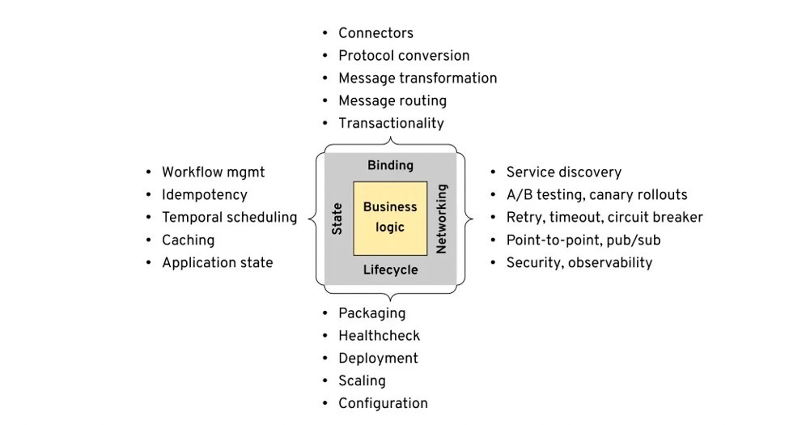
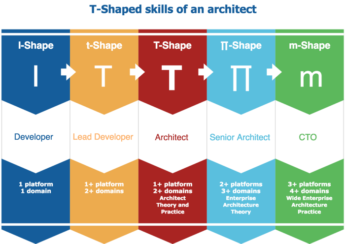
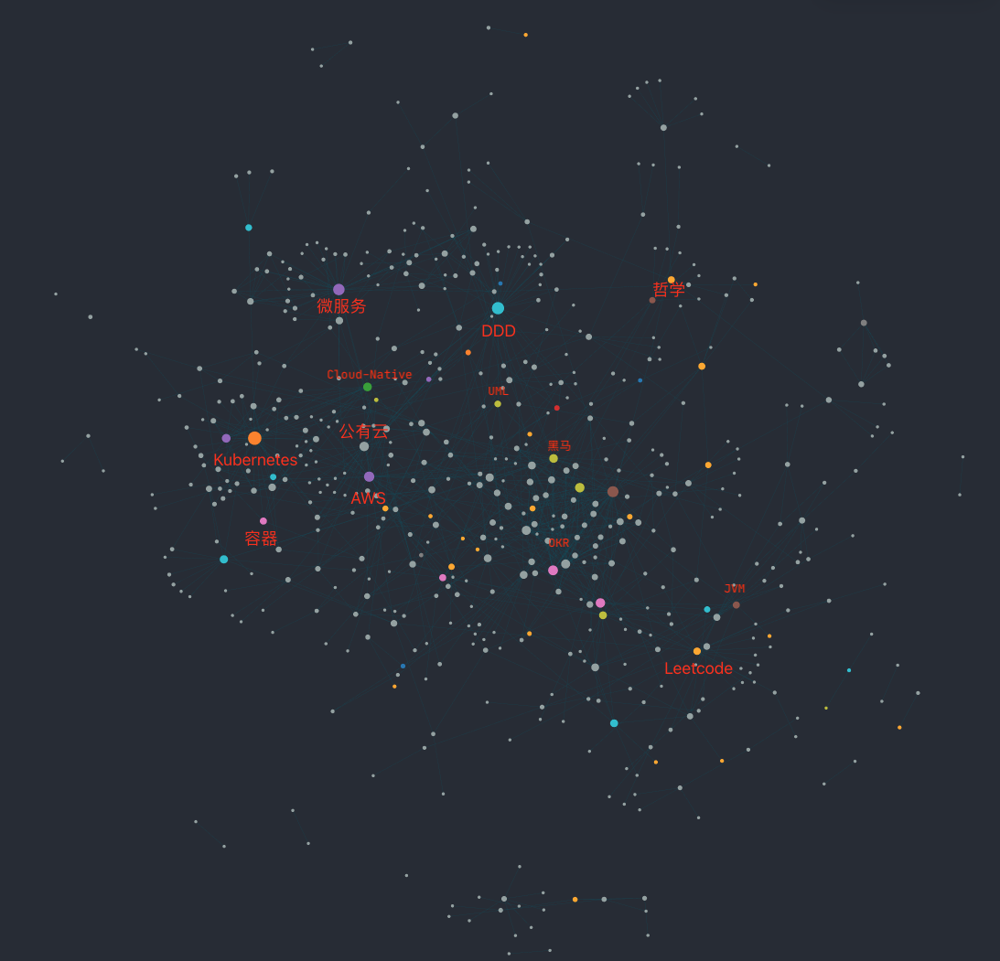
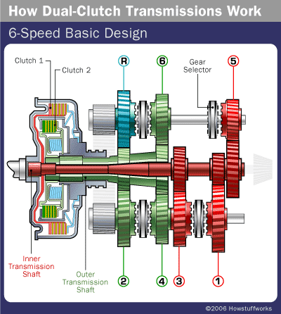
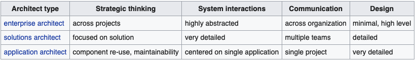
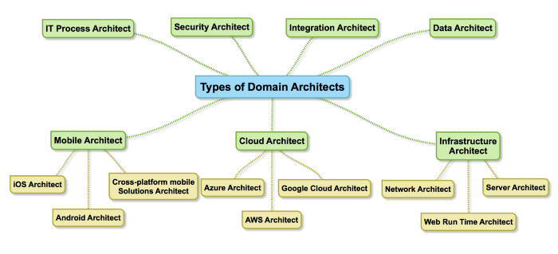
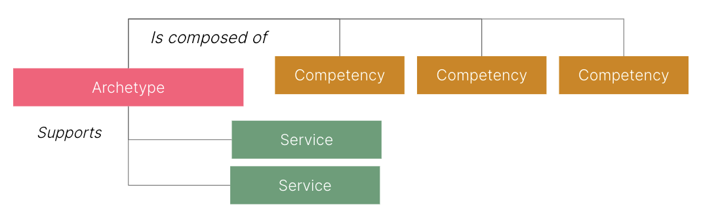
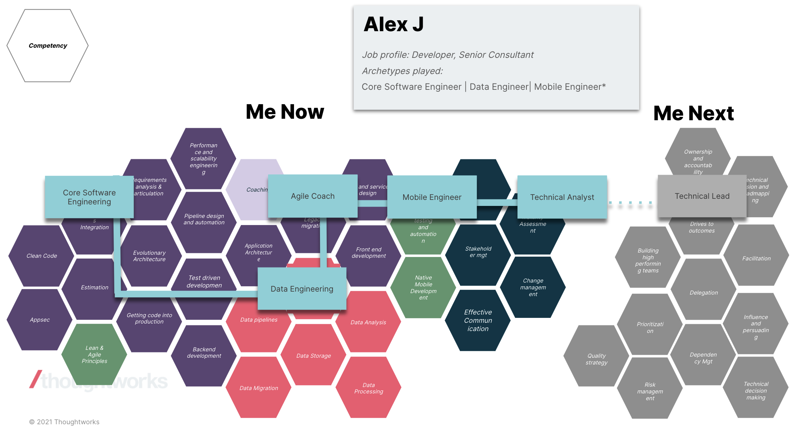

# Mesh-Shaped Cloud-Native Developer

## 背景：云原生的爆发

云计算在经过数十年的发展后，已经成为了 Internet 新的的超级基建。“我要不要上云” 的问题已经被业界用实际行动回答了，而 “何时何地以何种姿势上云” 才是接下来亟待解决的新问题。

当“应用迁移上云”的计划陷入了瓶颈，大家开始思考：“应用上云 / 云上的应用”是否有所不同？云上运行的应用是否应该因地制宜，基于云去重新设计其软件架构？

新的环境自然会催生出新的事物，云原生的概念一经提出便成为了云时代新的里程碑，随之建立的云原生基金会和云原生项目也如雨后春笋般快速发展。

> [Definition of Cloud-Native](#cncf)\
> Cloud native technologies empower organizations to build and run scalable applications in modern, dynamic environments such as public, private, and hybrid clouds. Containers, service meshes, microservices, immutable infrastructure, and declarative APIs exemplify this approach. \
> These techniques enable loosely coupled systems that are resilient, manageable, and observable. Combined with robust automation, they allow engineers to make high-impact changes frequently and predictably with minimal toil.

在云原生中，我们试图将功能性需求（Functional Requirements）与跨功能性需求（CrossFunctionalRequirements）进行解耦。利用容器、微服务、CI/CD、DevOps等技术为业务应用提供“安全营养无负担的环境”，云原生技术未来（Now!）将成为驱动业务增长的重要引擎。

在刚刚过去的2021年，云原生技术又迎来了新一轮的爆发：

- 容器成为了云原生应用的交付物标准，Kubernetes则成为了容器的运行和编排标准
- 而SMI（Service Mesh Interface）、OAM（Open Application Model）试图制定网络层和应用层的云原生标准
- 在过去几年中，业界见证了云原生技术的采用呈指数级增长：从互联网到工厂，从Web到IoT
- 而在去年，国内头部的互联网公司也都基本完成了云原生化：阿里、腾讯乃至信通院都发布了其云原生建设的愿景图
（见后文 [#Links](#reports)）

> **"大人，时代变了"**

## 背景：后端开发工程师的职业发展

作为一个以 “Java / 后端 / 开发工程师” 身份加入TW的程序员，我时常会对自己的角色定位产生疑惑：

- 写了3年Kotlin，没遇到几次高并发；JVM一知半解，八股文半窍不通；
- 能写React组件，能测Hooks逻辑；搞过CICD流水线，也做过Terraform自动化；
- DevOps咨询、AWS解决方案、售前打单...

然而，随意翻开一些互联网公司的后端工程师JD：Spring手撕、JVM调优、Redis原理。这些技能是后端所必须的吗？具备这些技能就能够打造出市场所需要的产品吗？那我这样“不务正业”的Java后端又该何去何从呢？

### 纵向发展 vs 横向发展

开发者究竟是应该: 横向发展 —— 广度优先：博览群书 / 还是纵向发展 —— 深度优先：专治疑难杂症？

如果我们从更高的维度来看，开发者在向CTO的发展过程中，需要在不同的时机去发展横向和纵向的能力，例如：随着影响力和权利的不断扩大，管理、沟通等软实力也和技术能力同等重要。
（见后文 [#扩展：如何定义架构师](#扩展：如何定义架构师)）

因此，从长远来讲我们既要关注所在领域的技术深度，也要不断挖掘并拓宽自己的未知领域。而每一种知识、每一项能力，也可能是其他基础知识、基本能力的一种组合；知识与知识、能力与能力之间也并不孤立，而是有着千丝万缕的联系和耦合的。

最终，可能每个人掌握的技能都不是一个简单的“T”，或是“M” —— 技能树？No 能力网？Yes

#### “劳动分工”的陷阱

劳动分工带来了纵向发展的需求，但其本质是为了提升某一专业领域的产出效率。而一些所谓的 "专业领域" 实际上是由资本家划分出来的：以便让劳动者与某种专业领域绑定，将劳动力作为“商品”进行售卖，e.g. 我需要一个SSH后端开发。一旦将劳动力与商品等价，“议价”“打折”“促销”的商品交易手段也就同样适用于劳动力交易 —— 内卷。

（推荐）[【硬核社会学】996、内卷、打工人：马克思为什么是对的（上）| 23:22](https://www.bilibili.com/video/BV18z4y1C7rX)

---

## 00.前言

在一开始进入IT行业时，我就有一个目标/RoleModel —— 独立开发者。因为我觉得编程是一件很酷的事情，可以使用不同的语言、不同的框架、不同的服务，像乐高一样随意组合，做出各种各样更酷的程序。Thoughtworks 秉承的技术卓越，也让我在加入之后有机会了解和尝试到非常多前沿的、新鲜的技术（Tech Radar）。

在尝试了一些不同的技术栈、角色和项目之后，我所熟悉的领域和掌握的技能也慢慢超出了后端的范畴。而各大微信技术群里大家对Spring源码、JVM优化的讨论还依旧火热，总让我怀疑是不是走错了方向。同样是CRUD程序员，为什么我们的关注点会不一样呢？

在深入学习了云服务，了解了云原生之后，我发现这个问题的答案可能是“开发模式的变革”：

- 以前，软件产品的“业务和技术”是难以分离的，在编写业务逻辑时还需要考虑非常多运行、部署、维护的问题
- 现在，云抽象了物理和网络设备、云原生抽象了技术组件和开发模式，开发者有了更简洁易用的工具

> “就像配电脑一样，淘宝京东、下单三大件、参照说明书、一键点亮” —— 云原生的开发模式

## 01.云原生时代的开发模式

“抽象 —— 编程的本质，是对问题域和解决方案域的一种提炼”
“封装、继承、多态 —— 不仅是面向对象的特性，也是软件技术进步的方向”

### 技术下沉

云计算站在软/硬件之上提供了更高层级的封装，抽象出了更通用、更实用、更易用的解决方案。随着某一个问题域被充分的解决，所有可能的解决方案和相关的技术都将被封装起来，抽象并打包成某一个产品 —— 云服务。（最近2年很多独角兽企业都是技术服务公司，甚至很多运营的是开源产品，Strapi、Hashicorp、PingCAP…）

解决的问题域越多，我们可用的服务就越多，我们就越容易利用这些已有方案去解决新的问题。在云时代以前，大家面向过程、面向对象，基于Java、基于Python，构建前端、构建后端；在云时代后，我们使用容器、Serverless、IaC。

技术下沉带来的是基础设施的变革，基础设施的变革带来的是产业升级。

### 螺旋式上升

“螺旋式上升”这个词很好的形容了历史、科技的进步规律。从历史中，我们得知了电、发动机等技术如何推动了电器、电脑、汽车、飞机的发展，进而推动了社会的进步。站在今天，软件技术同样也经历着这样一个过程：云计算所带来的技术下沉，会引起更多的连锁反应。

以前想要搭建一个数据库，要在网上搜索很久，怎么下载安装、怎么设置IP、怎么配置主从Copy。而现在，独立上市的数据库企业就有10+，并且越来越多的收入是来自于订阅式的云服务。以前只存在于脑洞中的技术，也都慢慢的走上了台面：

- 对业务的抽象：Low-Code/No-Code
- 对编程的抽象：BA with AI-Developer - autopilot
- 对架构的抽象：Architecture as a Service(AaaS)

这里特别提一下腾讯的小程序，现在已经完全和腾讯云打通：可以使用 IDE 完成整个开发、部署，使用和控制云上服务（云函数、云存储等），而无需登录腾讯云 —— one person, one army。

### 以不变应万变

面对变化如此迅猛的后云时代，作为开发者如何才能跟紧？

> “学好数理化走遍天下都不怕”

数学、物理、化学是世界运行的一些客观规律，同样的，在计算机技术领域也有着这样的“上帝法则”：算法、CPA、流水线、一致性协议，等等。“利用AWS MQ实现异步消息”和“CPU与外设的DMA异步通讯”，可以说都是AIO在不同层面的一种应用。（量子计算机是另一个话题，逃）

所以，我虽然反感八股文，但我仍认为算法、计算机组成原理等基础知识是所有开发者都应该去了解并掌握的。在旧技术不断下沉、新技术螺旋上升的时候，这些“法则”将帮助你保持较高的学习能力和适应能力。

## 10.云原生时代的开发者

狭义上讲，“云原生开发者”顾名思义就是从事云原生有关技术的开发者，比如容器、CI/CD、云服务，等等。他们对已知的问题域进行分析和解答，并形成可复用的解决方案，以某种技术服务的方式提供给其他人 —— Working on Known Area（e.g. 云厂商的Solution Architect）

但是云原生的目的是为了更好的支持“业务应用”，也就意味着在提供解决方案前，你得明确问题域是什么。要先能理解业务、商业、组织的问题，设计出合理的“业务应用”；才能进一步规划和采用相应的解决方案，实现应用的云原生。

广义上讲，“云原生开发者”则是了解、掌握云原生相关理论和技术的人，并能够使用这套规则来提高自己、团队、企业的开发效率，实现技术驱动业务增长 —— Working on Unknown Area（e.g. Thoughtworks的机会）

### “云原生开发者 ≠ 后端”

“面试造核弹，上班拧螺丝”是如今大多数公司面试的一个缩影，也受到非常多人的吐槽。但反过来想，即使掌握了“核弹”技能，就能显著的提升开发的效率和质量吗？怎样把“螺丝”拧的又快又好，是不是更应该努力的方向？

而在云服务和云原生兴起的今天，一些过去的“高级技术”已经被抽象成了“基础服务”。随着基础设施的标准化，后端要解决的核心问题已经从“服务器开发”转向了”服务端业务开发”。

### “云原生开发者 ≠ DevOps”

“DevOps”及“SRE”文化本身就是云原生中关键的一环，因此可以看做是云原生开发者的一个子集。但是当我们聊到微服务时，会发现微服务拆分并不是一个纯粹的技术问题：组织架构、业务形态、行业领域，都可能会影响我们的微服务拆分，从而影响到容器、运行环境等技术架构。

因此，云原生开发者也不能脱离业务场景而存在 —— “不是每一家公司都是阿里，你可能并不需要中台”。国内一些公司对DevOps的职责需求可能更靠近“Ops”一点，而基础设施的开发通常叫“工程效能团队” 或 “基础架构组”。

### “云原生开发者 ≈ 全干工程师 ≈ 10xDeveloper ≈ Architect”

如果一个人能够很好的应用云原生的理论和技术，并且适应于云原生的开发模式，那么他实际承担的是架构师的职责了。他需要看到不同维度、不同领域、不同技术，并且选择合适的技术和架构，以应对不断变化的业务场景。

现在大家都用的机械键盘（打字都很快），一个开发者想要完成十倍于人的工作量是很难的，但一个云原生开发者可以利用云原生服务：

- 目标：提升团队、项目、企业的运行效率（10x团队）
  - By：优化了软件开发效率（10x程序员）
  - By：提升了组织沟通的效率（10x催化剂）
- 结果：“10x Developer”

一个更贴切的名称是 —— “全干工程师”。

## 11.Mesh-Shaped 成长模型

在计算机科学范畴内，不同的层级（操作系统、应用软件、分布式应用）和不同的领域（移动端、服务端、云端）下的很多技术原理是一致的。当你学会了某一项原理后，可以快速的“移植”到另一个领域，或是增强某一领域的技能。而在云原生时代，软件的抽象层级变化的更为剧烈（单机、多线程、稳定 -> 云、多机、弹性），CNCF Landscape的项目每天都在变化，如何快速的进入一个新的领域？或是学习一项新的技术？

“以不变应万变” —— 我所理解的云原生时代的开发者/架构师，应该不止于“T” or “π”的能力：多个基础“学科”的扎实功底，在此之上构建起跨学科、跨领域的技术专长，并不断发散以吸收新的知识。

就像很多物理学家都有不错的数学功底，同时还会研读哲学，不同领域的知识能够为他提供不同的视角。

### 就像一张网（Mesh）

每一项技能不再只是一个“有或无”的标签，职业发展也不应该只有一个方向。你所有的知识和技能应该形成一个网状结构，每个点都能与另外的知识和技能产生链接：

- 多个技能叠加buff，战斗力翻倍
- 相辅相成，加深理解
- 借助其他已有技能来学习新技能、熟悉新领域（像消消乐一样）
- 通过拓展边界、增强核心域，不断改变自己的定位（网心）
- Try everything

## N.总结：展望未来

"Mesh-Shaped + Cloud-Native = 全新的职业生涯"

### Cloud-Native Developer

> 汽车变速箱的档位越高，能驱动的力就越大，车就跑的越快。齿轮传动（杠杆原理），小齿轮转速不变的情况下，大齿轮越大扭矩越大。
36公斤的力量怎么推动一公吨的车重呢？而且动辄数千转的引擎转速更不可能恰好成为轮胎转速，否则车子不就飞起来了？幸好聪明的人类发明了「齿轮」，利用不同大小的齿轮相连搭配，可以将旋转的速度降低，同时将扭矩放大。由于齿轮的圆周比就是半径比，因此从小齿轮传递动力至大齿轮时，转动的速度降低的比率以及扭矩放大的倍数，都恰好等于两齿轮的齿数比例，这个比例就是所谓的「齿轮比」。

云原生开发者就是这个变速箱，能够灵活的选用合适的档位，以驱动不同级别的业务需求：

> “他用了排水渠过弯！甚至还踩了一脚油门！”

### Mesh-Shaped Developer

之前阅读Web 3.0的时候看到一句话很好：

> “只有个体能够构建网络，网络才能围绕个体构建”。

我们通过掌握更多的技能、构建更大的能力网的同时，周围的人、事、物才会被我们的网所吸引和连接，才能有更多的机会创造更多的可能。

> “拓宽边界，不止当下”

---

## 扩展：如何定义架构师

### 架构师：职能要求 Expectation vs Domain 专业领域

But，不是每个人都能成为CTO的，但大多数程序员心里都会有个“小目标” —— 成为架构师。要想成为架构师，我们得先定义什么是架构师？

#### Software Architect

> A software architect is a software development expert who makes high-level design choices and tries to enforce technical standards, including software coding standards, tools, and platforms.

Wiki（现在好像没有这段描述了）上将 Software Architect 分为了三类：

这样的分类实际上是取决于公司对架构师这个角色的“职能要求”的不同。虽然大多数时候，Enterprise > Solution > Application，但他们并不是包含关系，而是在不同的维度处理各自的问题。e.g. Senior Enterpeise Architect, Head of Solution Architect...

#### Domain Architect

如果将专业领域作为架构师分类的依据，那么就会变成这样：

### 开发者：胜任力 Competency vs Archetype 原型

那么，Cloud Architect应该是Solution Architect还是Enterprise Architect呢？在不同的职能要求和专业领域下，对架构师的分类不再是一个简单的 A is B。如果无法对架构师进行一个合理的分类，那就无法定义某一类架构师的职责，也就无法规划一个有效的发展路线。

在做Performance Review的时候，我发现Thoughtworks的[Pathway](https://pathways.thoughtworks.net/)给了一个非常好的模型：

- Role + Grade 是一个对你工作职责（Job Profile）的高度总结，也包含了公司期望你必须具备的技能和产出
    e.g. Developer Senior Consultant，Experience Designer Lead Consultant
- Archetype 则提供了另一个维度来描述你的工作职责 —— 在特定领域的胜任力
- Competency 则是抽象出来的一系列基础能力 e.g. 开发、Consulting、沟通...

当你想要从Developer向Tech Lead发展时，能非常清晰的看到目标所需要的核心能力是什么，你欠缺的能力是什么，你所需要补足的是什么。

而被这样的发展路线所组织起来的各种能力也恰恰形成了 —— “#-shaped”。

## 扩展：知识管理

之前很长一段时间我都是使用的Typora+Trello来做任务管理和知识积累，在我不停拓展技能网的时候，这两个工具不再能满足我的需求了。当我想要构建一个技能网时，我需要把技能网相关的知识结构也都记录下来。

因此，我的代办列表和知识库也需要是“Mesh-Shaped”、离散但又相互连接的，才能够帮助我构建和维护这样的技能和知识。（康威定律？）

最后选用了最近比较火的Logseq，并且已经安利给了很多同事。

### “Logseq!!!”

- [Logseq - Build your own Wiki](https://anddd7.mesh-shaped.top/2022/02/12/Logseq-Build-your-own-Wiki/)
- [Logseq - Customized with Clojure and CSS](https://anddd7.mesh-shaped.top/2022/02/24/Logseq-Customized-with-Clojure-and-CSS/)

## Links

### Reports

- SlashData 云原生开发生态 | [The State of Cloud-Native Development 2021 Q1](https://www.cncf.io/wp-content/uploads/2021/12/Q1-2021-State-of-Cloud-Native-development-FINAL.pdf)
- [CNCF 2021年度调查报告](https://mp.weixin.qq.com/s?__biz=MjM5MDE0Mjc4MA==&mid=2651106517&idx=3&sn=fc21f1a29d582fbb483d12f3b6178ac0&chksm=bdb954868acedd90c14e12a9f5675685b560fa043a93b9550bc45406394101d5a7f0be8db044&mpshare=1&scene=1&srcid=0214kerzprubNiE3J0be7HJA&sharer_sharetime=1644822581245&sharer_shareid=eff20db62f686469259d202fc0146a67#rd) | [CNCF-Annual-Survey-2021](https://www.cncf.io/reports/cncf-annual-survey-2021/)
- Datadog 容器使用 | [datadog-container-report](https://www.datadoghq.com/container-report/)
- Datadog 无服务使用 | [datadog-state-of-serverless](https://www.datadoghq.com/state-of-serverless/)
- [Sysdig 2022年云原生安全和使用报告](https://segmentfault.com/a/1190000041422184) | [2022 Cloud-Native Security and Usage Report](https://sysdig.com/blog/2022-cloud-native-security-usage-report)
- [展望架构的 2022：热度居高不下的云原生，如何撑起架构的未来 - 阿里云](https://www.infoq.cn/article/S9wzvZU6BZMpMbkbvVQI)
- [2022 年，云原生领域有哪些值得关注的趋势？ - 阿里云](https://www.infoq.cn/article/KxPztASa2Sfbwo4dZ4iF)
- [解码2022年云原生落地技术趋势 - 微软](https://segmentfault.com/a/1190000041371751)

### CNCF

- CNCF（Cloud Native Computing Foundation）云原生基金会
  - [CNCF-Foundation](https://github.com/cncf/foundation/blob/main/charter.md)

### Architect

- [Types of Software Architects](https://medium.com/@nvashanin/types-of-software-architects-aa03e359d192)
- [Growth Paths at TW](https://docs.google.com/presentation/d/1ia5GdebBrFZoSvXqM5hk9kUXYGaSYFUq46m8Uz8I7E4/edit)
- [Development Career Paths](https://docs.google.com/presentation/d/1O24SOrZN9OTE3oGSZ53e4L2rPxKmt6gPJYroCm_uMzE/edit)
