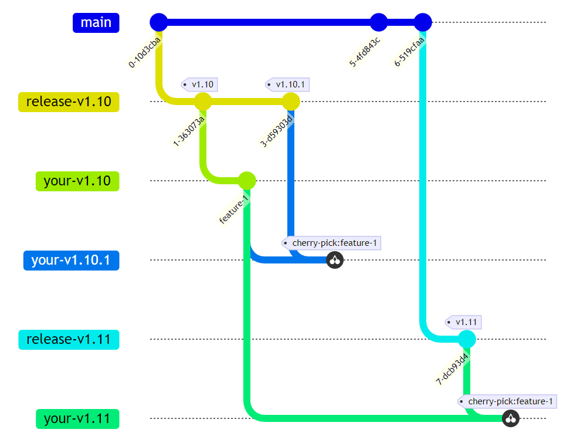
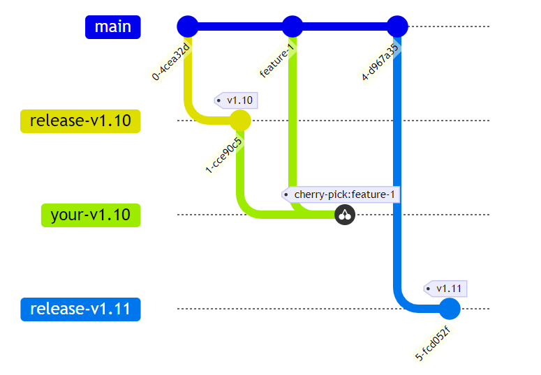

# Fork 一个开源项目的挑战

@{开源, 技术管理}

通常，在使用开源软件的过程中，我们会遇到一些问题，可能是我们自己的需求，也可能是开源软件的一些 bug。你会通过提交 issue 或者 pull request 的方式来尝试解决这些问题。但是，有时候你的需求并不会被马上合并和发布，甚至被社区拒绝。

团队管理者会有几种选择：

**购买开源软件的商业支持**

- 一些开源软件的维护者（组织、公司）会提供商业支持，这样你可以获得更快的响应和解决方案。
- 他们会根据客户的级别来调整服务的优先级，从而影响Issue和PR的处理速度以及Release的发布时间。
- 他们会根据客户的规模（用户数、收入等）来调整服务的价格。
- 当团队规模持续增长时，商业支持的价格可能会超出预算。

**积极参与开源社区**

- 可以发动团队成员参与开源社区，培养团队的技术能力
- 可以通过参与开源社区，获得更多的技术资源和人脉
- 提升影响力，从而影响开源软件的发展方向
  - 虽然听起来有些不公正，但开源本身也是一种共创式制定标准的手段
  - 参与开源就要对社区负责，即使是 PMC 也并不意味着可以随意修改 Roadmap
- 需要平衡开源贡献的成本和收益
  - 需要花费多少时间在 PR 上
  - 需要等待多久才能 Release
  - 需要多少人兼职、全职的参与

**Fork 一个开源项目**

- 自己维护一个分支
- 可以自由的发布自己的版本
- 可以自有的添加自己的功能
- 可以自由的选择优先合并的 PR
- ...

相信很多规模较大的团队都会考虑，通过 Fork 开源项目来解决类似的问题 ...

## Fork 一个开源项目的挑战

最大的挑战是如何保持自己的 Fork 版本与原始版本的同步。

### Issue / PR 阶段

#### 挑战一：你的 issue 可能不会被处理

你提交了一个 issue，但是维护者并没有立即处理，或是直接拒绝了你的提议。

你是否还需要这个功能？

- No，关掉这个 issue，寻找替代方案
- Yes，fork 这个项目，自己实现这个功能 ... 除此之外你还需要 ...

> 你的 commits 可能会很快过期，当上游的新版本发布时，你需要将你的 commits rebase 到最新的版本。例如，你基于 v1.10 fork 了一个项目，现在你想升级到 v1.11。
>
> 每一次上游版本的升级，你的团队都需要疲惫地处理冲突 💀，特别是当你有很多这样的 commits 时。



<!-- ```mermaid
%%{init: { 'gitGraph': {'rotateCommitLabel': true}} }%%
gitGraph
    commit
    branch release-v1.10
    commit tag: "v1.10"
    
    branch your-v1.10
    checkout your-v1.10
    commit id: "feature-1"

    checkout release-v1.10
    commit tag: "v1.10.1"

    branch your-v1.10.1
    checkout your-v1.10.1
    cherry-pick id: "feature-1"

    checkout main
    commit
    commit
    branch release-v1.11
    checkout release-v1.11
    commit tag: "v1.11"

    branch your-v1.11
    checkout your-v1.11
    cherry-pick id: "feature-1"
``` -->

> Tips:
>
> - 保持你的 commits 小而简单
> - 避免删除原有代码，通过 feature-toggle 的方式来跳过
> - 创建新的文件、函数来实现你的功能，在原有文件中只是调用
> - 通过配置文件、环境变量、流水线在编译和运行时注入代码
>
> 以上小技巧能帮助你减少 rebase/cherry-pick 时的冲突

#### 挑战二：你的 PR 短期内无法发布

即使你的 PR 被合并，社区通常有自己的发布计划，可能需要很长时间才能发布。以我参与的 ingress-nginx 为例：

- Issue raised Apr 10
- PR created Apr 13
- PR merged May 27
- Tagged Release 1.11 (probably in Sep)
  - 1.10.0 at Feb, 2024
  - 1.9.0 at Sep, 2023

可以看到，社区对于 minor 版本的发布计划是 6 个月，也就意味着我的 PR 可能会在今年九月才会发布 ... 距离 issue 提交已经是半年过去了。

你是否还需要这个功能，现在？

- No，关掉这个 issue，寻找替代方案
- Yes，fork 这个项目，自己实现这个功能 ... 除此之外你还需要 ...

> 你仍然需要 rebase 你的 commits，但是相对于挑战一，这个过程会简单很多。
>
> 虽然会等待一段时间，但你的代码已经存在于下一个版本。一旦新版本发布，抛弃 Fork，按照官方的升级指南升级即可。



<!-- ```mermaid
%%{init: { 'gitGraph': {'rotateCommitLabel': true}} }%%
gitGraph
    commit
    branch release-v1.10
    commit tag: "v1.10"

    checkout main
    commit id: "feature-1"

    checkout release-v1.10
    branch your-v1.10
    cherry-pick id: "feature-1"

    checkout main
    commit
    branch release-v1.11
    commit tag: "v1.11"
``` -->

### Build / Release 阶段

#### 挑战一：你的构建可能会失败

很多开源项目都会依赖 Github / Gitlab 等平台的 CI/CD 服务，进行自动化构建和发布。当你 fork 一个项目时，原有的 pipeline 你是无法直接使用的，需要自己配置 CI 服务，包括：

- 你的 Fork 是否在私有仓库
- 你的 CI 能否访问你的 Fork 仓库
- 你的 CI 是否有构建代码的环境和依赖
- ...

#### 挑战二：如何发布你的 Fork 版本

同挑战一，开源项目会链接到官方的发布渠道，例如 Docker Hub、Github Release 等。在构建好你的 Fork 版本后，你还需要将他们发布到你的私有仓库中。

> 当然，你也可以选择发布到公共仓库，但是你需要注意命名冲突的问题。我在发布一个 python 包时，为了避免和上游版本的包冲突，重命名了整个 src 文件夹。
>
> <https://github.com/Anddd7/diagrams-ext>

#### 挑战三：如何测试你的 Fork 版本

现在，你可能是唯一一个使用你的 Fork 版本的人，当你遇到 Bug 可能也无法从社区获得有效的帮助。你需要做额外的测试，确保你的 Fork 版本没有问题 —— 除非你对自己的代码有 100% 的信任。

## 结论

在业界，有不少公司都创建了自己的 Fork 版本，但通常他们有很多定制需求和足够的资源来维护这个 Fork 版本。

- 云服务提供商：希望将自己的服务集成到开源项目中，例如负载均衡团队也会负责 Ingress 相关的内容。
- 金融行业：稳定性高于一切 ... 他们不需要那些新的功能，Fork 一个过期但稳定运行的版本，只添加安全相关的功能，是一个不错的选择。

当然，“性价比”才是决定因素，团队管理者需要算好手里的账：

- 经济账：购买商业支持 vs hire团队来维护分支
- 时间账：fork 项目 vs 等待社区发布
- 技术账：自己实现 vs 依赖社区

---

<div style="display: flex; justify-content: space-around;">
    
    
</div>
