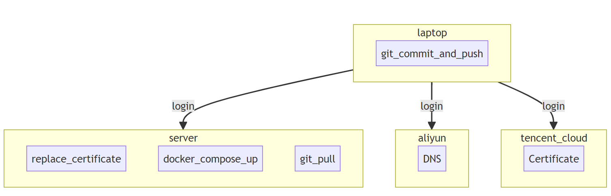
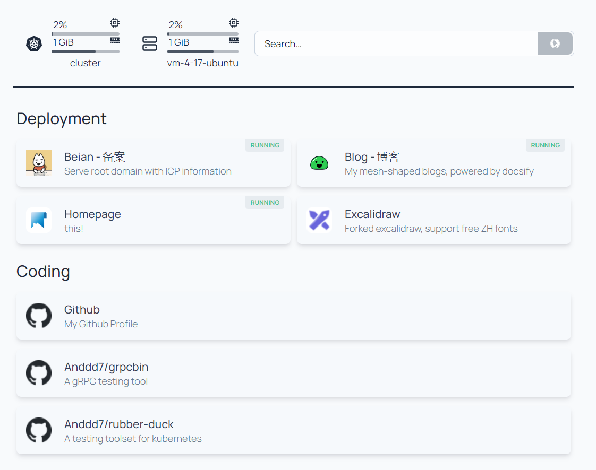
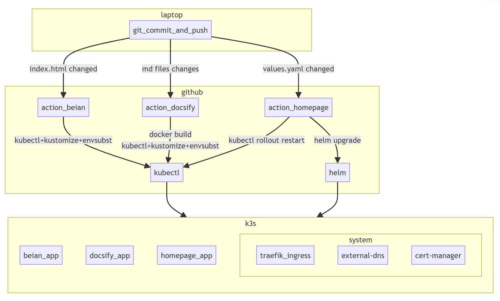

# k3s 搭建个人博客基础设施

<!-- 
key words:
- k3s kustomize
- cert-manager external-dns
- github actions
 -->

这个月初的时候对博客的基础设施做了一波升级，起因是因为免费的域名证书过期了，就想着把博客的基础设施迁移到 k8s 上，这样就可以使用 cert-manager 来自动续期证书了。虽然工作中做了不少 k8s、devops 的工作，但之前的博客还是依靠手动的 git pull 和 docker compose 来部署的，有点过于寒酸了。



<!-- 
graph TD
    subgraph laptop
        git_commit_and_push
    end

    subgraph server
        replace_certificate
        docker_compose_up
        git_pull
    end

    subgraph aliyun
        DNS
    end

    subgraph tencent_cloud
        Certificate
    end

    laptop -->|login| server
    laptop -->|login| aliyun
    laptop -->|login| tencent_cloud 
    -->

所以基于 k8s 设计了一套新的基础设施和部署流程，主要包括以下几个部分：

- 使用 k3s 部署所有页面（apps）
- 使用 ingress 做负载均衡
- 使用 external-dns 和 cert-manager 管理域名和证书
- 使用 github actions 自动部署

不过实施的过程中还是遇到了不少的坑 ... 回顾记录一下 ...

## k3s 安装

### Why

> k3s 是 Rancher Labs 开发的一个轻量级 Kubernetes 发行版，它的目标是在资源有限的环境中运行 Kubernetes。k3s 的设计目标是尽可能的小，同时保持生产就绪的特性。

我目前是使用的腾讯云主机 4c8g，续费价格颇高，考虑之后可能会换成更便宜的主机（aliyun 99）构建集群。因此安装完整的 k8s 对资源消耗太大，k3s 安装简单、资源消耗小，比较适合这样的轻量级场景。

### How

因为众所周知的原因，在国内服务器安装开源软件首先要考虑的就是镜像源的问题。好在 k3s 官方就提供了国内的镜像源，所以安装起来还是比较顺利的。

**需要注意的一点是，如果你使用单节点模式 —— 即主机有公网 IP 并提供直接访问。需要配置 k3s 使用公网 IP 来启用 Ingress，保证 ingress + external-dns 能够正确的将域名指向这台主机的公网 IP。**

```bash
if [ -z $PUBLIC_IP ]; then
    echo "PUBLIC_IP is not set"
    exit 1
fi

# use mirror for cn https://docs.k3s.io/zh/quick-start
curl -sfL https://rancher-mirror.rancher.cn/k3s/k3s-install.sh | INSTALL_K3S_MIRROR=cn sh -s - server --node-external-ip $PUBLIC_IP --write-kubeconfig-mode=644
```

### Verify

然后通过 `k get no` 来查看节点的状态，确保 k3s 安装成功并且 IP 地址正确。

```bash
$ k get no -owide
NAME             STATUS   ROLES                  AGE   VERSION        INTERNAL-IP   EXTERNAL-IP     OS-IMAGE           KERNEL-VERSION      CONTAINER-RUNTIME
vm-4-17-ubuntu   Ready    control-plane,master   19d   v1.29.5+k3s1   10.0.4.17     111.11.11.111   Ubuntu 22.04 LTS   5.15.0-86-generic   containerd://1.7.15-k3s1
```

- `INTERNAL-IP` 是 k8s 节点的 cluster ip
- `EXTERNAL-IP` 默认是 k8s 节点的 ip，如果使用 `--node-external-ip` 就可以指定 ip 地址

## Ingress

### Why

然后我们就可以开始安装 ingress、external-dns 和 cert-manager 了。这三个组件是网站基础设施的核心组件，负责负载均衡、域名解析和证书管理。

一开始我自行安装了 ingress-nginx，之后发现 k3s 自带了 traefik，也可以作为 ingress 使用，所以就直接使用了 traefik。

> traefik 是一款开源的反向代理和负载均衡工具，支持多种后端服务，如 Docker、Swarm、Kubernetes、Mesos、Consul、Etcd 等。traefik 通过监听 Docker 或 Kubernetes 的事件，自动更新配置，支持热更新。

### How

因为 traefik 会自动安装在 k3s 集群中，所以并不需要额外的安装步骤。

**需要注意的一点是，如果你使用单节点模式 —— 即主机有公网 IP 并提供直接访问。traefik 会默认使用 LoadBalancer 模式，使用当前节点的 EXTERNAL-IP 作为负载均衡的入口。**

- 所以如果你和我一样，在安装 k3s 时，重新指定了公网 IP 作为 EXTERNAL-IP，那么 traefik 就会使用这个 IP 作为负载均衡的入口。
- 如果不是 ... 那就需要通过修改 traefik 的 svc 来指定 EXTERNAL-IP = <外部负载均衡器的公网 IP>，来保证后续 dns 的正确生成

### Verify

可以看到，traefik 以 LoadBalancer 模式运行，并在节点上监听了 80 和 443 端口。

```bash
k get svc -n kube-system traefik -owide 
NAME      TYPE           CLUSTER-IP     EXTERNAL-IP     PORT(S)                      AGE   SELECTOR
traefik   LoadBalancer   10.43.115.98   111.11.11.111   80:32453/TCP,443:30949/TCP   19d   app.kubernetes.io/instance=traefik-kube-system,app.kubernetes.io/name=traefik
```

## DNS & Cert

### Why

> external-dns 是一个 Kubernetes 插件，它可以根据 Ingress 和 Service 的信息，自动的更新 DNS 记录。external-dns 支持多种 DNS 提供商，如 AWS Route 53、Azure、Google Cloud DNS、Aliyun、Tencent Cloud 等。

> cert-manager 是一个 Kubernetes 插件，它可以自动的申请和续期 SSL 证书。cert-manager 支持多种证书颁发机构，如 Let's Encrypt、Venafi、Certbot 等。

external-dns 就不用多说，可以保证 ingress 和域名解析的一致性。cert-manager 是为了自动续期证书，

### How

这两个都是成熟的 k8s 组件，提供 helm chart 方便安装。通常我会用这样的脚本来安装某一个组件：

```bash
# 安装额外的 manifests 资源，如 configmap，secrets 或是其他 CRDs
kubectl kustomize kustomization | envsubst | kubectl apply -f -

# 添加仓库
helm repo add external-dns https://kubernetes-sigs.github.io/external-dns/
# 安装，并指定 values.yaml 覆盖默认配置
helm upgrade --install \
    external-dns external-dns/external-dns \
    --namespace external-dns \
    --create-namespace \
    --version 1.14.4 \
    -f helm/values.yaml
```

#### external-dns

安装 extrenal-dns 时，需要注意两点

- 替换镜像源
  - 默认镜像存放在 kubernetes.io 中，在国内基本访问不了
  - 替换成 docker.io（无前缀），也有一定几率访问不了 —— （最新新闻，dockerhub 镜像大批下架）
  - 所以，最好替换成稳定的、可信的、高速的源
- 配置 AKSK
  - 因为我使用的是腾讯的主机，没法使用 RAM Role + STS 进行验权
  - 所以只能使用 AKSK 的方式，将 AKSK 保存在 secret 中，然后挂载到 pod 中
  - external-dns（alicloud provider）是通过读取配置文件的方式来获取 AKSK 的
  - 所以需要将配置文件挂载到 pod 中，并添加 `--alibaba-cloud-config-file` 来指定配置文件的路径

```yaml
# bind and use the config file with aksk
extraArgs: ["--alibaba-cloud-zone-type=public", "--alibaba-cloud-config-file=/etc/kubernetes/external-dns/alibabacloud-cloud-config.yaml"]

extraVolumes:
- name: alibabacloud-cloud-config
  secret:
    secretName: alibabacloud-cloud-config

extraVolumeMounts:
- name: alibabacloud-cloud-config
  mountPath: /etc/kubernetes/external-dns
  readOnly: true
```

#### cert-manager

和 external-dns 类似

- cert-manager 也需要替换镜像源
- cert-manager 并没有官方的 alicloud provider，只能通过 webhook 模式进行扩展
  - 找到的多个 alidns-webhook 都有些过期了
  - 目前使用的是 <https://github.com/wjiec/alidns-webhook>
- 因此，需要安装的有
  - cert-manager
  - cluster-issuer (with AKSK secret)
  - alidns-webhook

```bash
# cert-manager
helm repo add jetstack https://charts.jetstack.io

helm upgrade --install \
    cert-manager jetstack/cert-manager \
    --namespace cert-manager \
    --create-namespace \
    --version v1.14.5 \
    --set installCRDs=true \
    -f helm/values.yaml

# prepare the secret for aksk and cluster issues
kubectl kustomize kustomization | envsubst | kubectl apply -f -

# alidns webhook
helm upgrade --install alidns-webhook alidns-webhook \
    --repo https://wjiec.github.io/alidns-webhook \
    --namespace cert-manager \
    --create-namespace \
    --set groupName=acme.mesh-shaped.top
```

### Verify

可以通过部署一个 nginx 测试一下 ingress 是否正常工作

## 部署 Apps

最后，你就可以准备 deploy.yaml 部署你的博客了。因为政策原因，根域名的网站上必须带有备案信息，所以我单独构建了一个页面作为备案信息页。在我的集群中会部署以下应用

- beian：备案信息
- docsify：博客
- homepage：导航页（一个很有意思的项目）

### Homepage

> homepage 是一个简单的导航页，通过 values.yaml 配置 的你快捷链接、仪表盘和个人空间。



### Github Actions

博客会频繁更新，因此我使用了 github actions 来自动部署博客。每次 push 到 main 分支，actions 就会根据修改的路径触发不同的应用部署流程



<!-- 
flowchart
    subgraph laptop
        git_commit_and_push
    end

    subgraph github
        git_commit_and_push -->|index.html changed| action_beian
        git_commit_and_push -->|md files changes| action_docsify
        git_commit_and_push -->|values.yaml changed| action_homepage

        action_beian -->|kubectl+kustomize+envsubst| kubectl
        action_docsify -->|docker build\nkubectl+kustomize+envsubst| kubectl
        action_homepage -->|helm upgrade| helm
        action_homepage -->|kubectl rollout restart| kubectl
    end


    subgraph k3s
        beian_app ~~~
        docsify_app ~~~
        homepage_app ~~~ system

        subgraph system
            traefik_ingress 
            external-dns 
            cert-manager
        end
    end

    kubectl --> k3s
    helm --> k3s
    -->

- beian
  - 只是简单的将 index.html 通过 configmap 挂载到 nginx 中
  - action 只需应用新生成的 configmap 进行替换即可

- docsify
  - 会将 md 文件和 docsify 程序打包进容器进行运行
  - action 会重新 build docker image
- 使用 kubectl + kustomize 应用新的 yaml

- homepage
  - homepage 是通过 helm 安装的，只需要修改 values.yaml 进行配置
  - action 检测 values.yaml 的修改，并执行 helm upgrade

---

<div style="display: flex; justify-content: space-around;">
    
    
</div>
