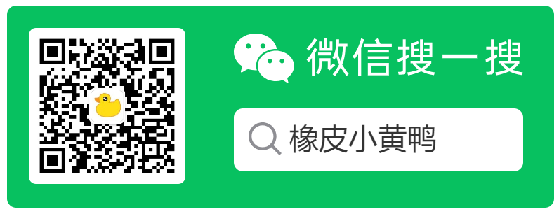

# Mesh-Shaped PKM - AI Powered

从 2022 年开始使用Logseq到现在，所构建的 [Mesh-Shaped 的知识管理模式](migrate/logseq-pkm.md) 逐渐成熟，帮助我高效的学习、工作和生活。在最近一年对AI的学习和实践中，我发现AI技术可以帮助我更好的管理知识，提高工作效率，因此我将AI技术融入到Mesh-Shaped PKM中，构建了一个AI Powered的知识管理模式。

## AI Powered

最大的改变是信息的输入变得简单了，在之前的模式中：

- 需要通过多种工具来收集信息，包括任务、稍后阅读、知识等
- 需要在Logseq中进行信息初筛，任务规划，以确定哪些是闪念、哪些是需要深入学习的知识、哪些是任务
- 需要在Logseq中存储和分类大量的笔记，建立双链
- 需要定期整理、总结、精炼

有了 AI 之后，我几乎没有再复制过超过200字的文本，也没有再添加过超过10张图片或是超链接。你可以仅保存一个AI的会话链接，或是一段Prompt，就可以得到超过1000字的回答。

因此我重新构建了我的工作流，并将AI显式化的嵌入到各个流程内。

## 任务驱动

我将我的工作流程分为了三个部分：

- **任务驱动：“飞轮”系统**
  - 飞轮系统是一种更宏观的目标管理方法，它侧重于长期愿景和持续的进步：
  - 愿景：设定一个长远的愿景或目标，这个目标可能并不具体，但提供了方向。
  - 行动：在执行过程中，通过不断的尝试和调整，逐步接近愿景。
  - 反馈：从行动中获得反馈，这些反馈可能会产生新的GTD任务或是调整飞轮任务。
  - 迭代：根据反馈不断调整行动计划，以确保持续向愿景靠近。

- **任务执行：GTD 系统**
  - GTD系统强调的是任务的明确性和可操作性，它要求任务有明确的目标和步骤
  - 收集：将所有任务和想法收集到一个“收集箱”中，以便不会忘记任何事情。
  - 处理：对收集到的任务进行快速处理，决定是立即执行、委派、延迟还是删除。
  - 组织：将任务分类并放入不同的“篮子”中，比如等待清单、项目清单、日程表等。
  - 回顾：定期回顾任务清单，确保所有任务都得到适当的关注。
  - 执行：根据优先级和可用时间执行任务。

- **获得反馈**
  - 输出型反馈，写文留存
  - 输入性反馈，新任务

> 所有事务都会以任务的形式存在，比如 读一本书、尝试一个工具，并且有对应的反馈机制，以便不断迭代。
>
> 以往的 PKM 是以笔记为核心，重在收集、整理和记录。而借由 AI 赋能后，你的笔记本质上已经是无限大了，Knowledge Management 已经没有意义，更重要的是如何利用这些知识来创造价值 —— 即任务驱动。

> 可以看到，AI 可以在目标管理、任务拆解、任务执行（信息收集、整理、编码）等多个环节中发挥作用，从而提高工作效率。

## 工具使用

我主要会用到以下 AI 工具：

- Copilot：代码、文档、博客编写（处理所有在VSCode里完成的任务）
- Logseq AI Assistant 插件：处理所有Logseq内的任务，代替人工的总结、翻译、tag、任务拆分、OKR & Retro ...
- Kimi：闪念和稍后阅读
  - 免费，且全平台可用（App、微信、Web）
  - 所有的想法和链接我都会先丢给 Kimi
    - 可以获得即时的反馈，比如一个问题的答案、一篇文章的摘要、一张图片的描述
    - 可以保存会话链接来“保存”这个想法，以便后续进一步处理
  - 对于有价值的内容，仅需要将会话链接保存到Logseq中，加上少量的描述和tag即可

## 随想

**Knowledge Management 已经没有意义**

原本的 Knowledge Management 也是为了解决信息过载的问题，利用软件（页、块、tag）建立索引，以便快速找到需要的信息。但随着 AI 技术的发展，索引变成了Prompt，信息变成了AI的回答并且存储在云端。

PKM 的终极目的还是提高工作效率，AI 技术的应用使得我们可以更加专注于任务的执行，而不是信息的收集和整理。因此，新一代的 PKM 应该是一个任务驱动的系统，以任务为核心，以任务的执行为目标。

---

    
    

