# 如何绘制架构图：Mesh-Shaped Architecture Views

| 版本 | 修改                     | 时间    |
| ---- | ------------------------ | ------- |
| v0.1 | 脑洞，思考元图解法       | 2023-04 |
| v0.2 | 大纲                     | 2023-05 |
| v0.3 | 主要内容（除架构视图）   | 2023-05 |
| v1.0 | 发布                     | 2023-07 |
| v2.0 | 重构，主要突出“软件架构” | 2023-08 |
| v3.0 | 重构，提出架构阶段       | 2024-12 |

- [如何绘制架构图：Mesh-Shaped Architecture Views](#如何绘制架构图mesh-shaped-architecture-views)
  - [前言](#前言)
  - [文字、图形和可视化表达](#文字图形和可视化表达)
    - [语言与文字](#语言与文字)
    - [图形和绘画](#图形和绘画)
    - [可视化表达](#可视化表达)
      - [图形的基本组成](#图形的基本组成)
      - [图形的表现形式](#图形的表现形式)
      - [图的表现力](#图的表现力)
  - [如何绘制软件架构图](#如何绘制软件架构图)
    - [明确目标受众](#明确目标受众)
      - [首席技术官（CTO）](#首席技术官cto)
      - [产品经理（PM）](#产品经理pm)
      - [架构师](#架构师)
      - [开发工程师](#开发工程师)
      - [技术顾问（Advisor）](#技术顾问advisor)
    - [关注点设立](#关注点设立)
    - [传递可视化信息](#传递可视化信息)
  - [Mesh-Shaped 架构视图](#mesh-shaped-架构视图)
    - [结构层次分解](#结构层次分解)
      - [隐含的层次](#隐含的层次)
    - [逻辑关系组织](#逻辑关系组织)
      - [设计阶段](#设计阶段)
      - [开发阶段](#开发阶段)
      - [运维阶段](#运维阶段)
    - [风格（示例补充）](#风格示例补充)
  - [总结](#总结)

## 前言

在当今快速发展的数字时代，软件已经成为了我们生活和商业中不可或缺的一部分。无论是移动应用、在线服务还是大规模企业系统，软件的复杂性和重要性都在不断增加。在如此复杂的软件生态中，良好的架构设计成为了确保系统可靠性、可维护性以及扩展性的关键。然而，如何将这些复杂的技术概念和设计思想有效传达给不同角色的团队成员，成为了一个值得深入探讨的话题。

架构图 —— 它作为一种视觉表达形式，将复杂的技术架构（逻辑关系、事件时序、组合泛化等）以图形的方式展现出来，抽象关键概念而无需深入技术细节。这种表达方式能够降低技术和业务之间的认知障碍，更容易实现统一语言，将架构设计的目的和价值传达给各种角色。无论是项目的初期阶段，用于明确系统的整体构架，还是在后续的开发、测试和维护阶段，用于在团队间共享设计决策，架构图都是一种简单普适又强大的工具。

> 帮助团队在**不同的阶段和层次**上理解系统，并在不同的角色之间促进更流畅的**沟通**。

## 文字、图形和可视化表达

> A picture is worth a thousand words. \
> 一画胜千言。

在人类的历史中，文字和图形一直是人们表达思想和传播信息的主要方式，它们各有优势并用于不同的场景和目的。

### 语言与文字

语言是人类交流和表达思想的最常用的一种工具，它通过语音符号来传递意义。语言的起源可以追溯到早期人类通过声音和手势进行基本交流的时期。随着人类智慧的发展，语言逐渐演化成为复杂的符号系统，用于表示事物（识物）、概念（辩理）甚至是抽象思维（哲学、宗教）。

文字是语言的可视化形式，用于通过抽象的符号记录和传播信息。文字的发展是为了解决语言的时间和空间限制，使得信息可以被保存、传递和阅读，超越了口头传述的限制。

语言和文字对人类文明的影响深远。它们不仅成为了人类思想和知识的媒介，还推动了人类社会的发展和进步。

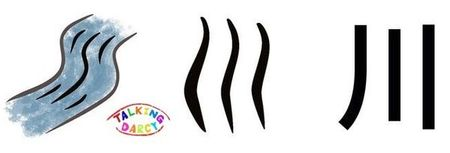

### 图形和绘画

图形是通过线条、形状、点和颜色等基本要素构成的平面或立体的视觉表达。它们可以是简单的几何形状，也可以是复杂的图案和图像，用于传达和表达特定的概念、思想或信息，具有艺术性、装饰性或功能性的目的。

> 使用 “文字” 还是 “图形” ？

在我们使用语言或文字表达某种信息时，会受到一些限制：

- 表现力有限：表达的内容体量和字数成正比。文字通过字词和句子的组合来传达意义，但很难准确地捕捉复杂的概念、情感和感觉。一些抽象的或非具象的概念可能需要通过其他手段的协助，如比喻、类比、隐喻等修辞手法，停顿、重音、断句等说话技巧。因此纯文字描述，会有非常多的上下文和修辞来强化表达的效果。
- 线性表达：文字的表达方式是线性的。在大部分文字书写系统中，写作和阅读方式都是从左至右、从上至下的。在一段文字中，前面的内容可能会影响对后续内容的理解，丢失上下文的阅读会引起很大的歧义。同时，线性阅读也限制了其传达多个概念或信息的能力。
- 依赖人脑处理：文字的理解依赖于人脑的分析、记忆和总结能力。读者需要通过解读和组织文字，将其转化为有意义的概念和思维模型。这可能涉及词汇理解、语法解析、上下文推断和知识联想等认知过程。不同的人具有不同的认知能力和知识背景，因此对相同文字的理解可能存在差异。
- 上下文负载：文字的理解通常依赖于上下文的负载。同样的文字，在不同的上下文中可能具有不同的含义和解读。读者需要综合考虑文字本身的表述以及所处的背景信息、语境和前后关系等因素，以理解文字的真正意义。

而我们在“阅读”一副图时，大脑的关注点和运行模式就不太一样了：

- 非线性阅读：相比于文字的线性阅读方式，图的阅读是非线性的。图中的元素可以在不同的位置和角度上呈现，并且读者可以根据自己的需要选择性地关注不同的部分。这种非线性的特性使得读者可以自由地浏览和理解图中的信息，以适应自己的思维方式和需求。
- 依赖视觉能力：图的阅读依赖于人脑的视觉能力。读者需要观察、分析和解释图中的形状、线条、颜色等视觉元素，虽然也需要经过人脑的分析，但如果图形本身和现实世界的概念或物体有相似之处，那么读者就可以直接理解图形的含义，而无需经过文字的转换。
- 数理逻辑表达：在图论和拓扑学中使用图来表达数学逻辑，是因为图提供了一种直观、可视化的方式来描述和分析对象之间的关系和结构。图的数理逻辑表达能力使得它们可以用于描述和分析复杂的关系和结构，如网络拓扑、数据流、组织结构等。

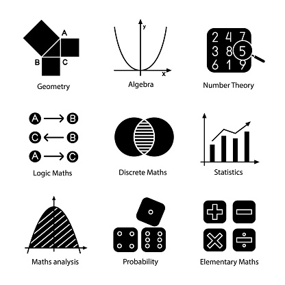

### 可视化表达

#### 图形的基本组成

图形通过视觉元素来传达信息，其表现力取决于组成这个图形的元素数量和种类。从广义的概念，一个图形包含的信息主要包括几何属性和非几何属性：

**几何属性**：刻画对象的轮廓、形状。

- 点：最基本的几何属性，通常用来表示一个位置或一个数据点。
  - 点和点的相对位置，则反应了数据间的亲疏关系。
  - 在数据可视化中，点经常被用来表示离散的数据项，如散点图中的数据点，或地图上的地理位置。
- 线：线是由两个或多个点连接而成的几何形状。
  - 线段，可以用来表示各种关系和连接，如连接两个点之间的路径
  - 箭头，带上方向的线，可用于表示空间、时间上的顺序关系。
  - 折线、曲线，改变形态的线，用于表达数据的变化趋势。
- 面：面是由多个线段或曲线围成的闭合区域，具有面积和形状。
  - 方框，常用来表示数据的分布、范围或区域。
  - 圆圈，在地图中，面被用来表示地理区域、行政区域或统计区域。
- 体：体是由多个面围成的立体形状，具有体积和形状。
  - 立方体、球体，体通常用来表示物体的形状和空间位置。
  - 在建筑设计中，体被用来表示建筑物的结构和布局。

> 还有一个隐藏的几何属性是 “坐标系”。同一个物体（概念、元素）在不同的坐标系上，可能处于不同的状态，使用点组成线、面、体，在更高的坐标系上，又回归为一个点。\
> 如，一个街道的交通规划，在市的坐标系上表现为一条条线组成的交通网络。但在省的坐标系上，会抽象为一个点，仅作为省道、国道规划的一个组成点。

**非几何属性**：视觉属性，刻画对象的颜色、材质等。比如明暗、色彩、纹理、透明性、线型、线宽。

- 颜色：颜色是非常重要的属性，可以用来表达数据的不同类别、特征或重要程度。因为人眼对不同颜色的敏感度不同，选用合适的颜色可以帮助读者更好地理解和记忆信息。例如，使用红色表示紧急的信息，使用绿色表示正常的信息。
- 纹理：纹理是通过斑点、线条、图案或阴影等视觉效果来增加图形的细节和复杂性。纹理可以用来表示表面的质地、模式或特征。如虚线表示虚拟的边界，阴影表示物体的凹凸表面。
- 明暗：明暗是指图形的亮度和对比度。通过调整明暗，可以增加图形的视觉效果和对比度，用来突出显示某些部分或强调关键信息。如将前景物体调亮，将背景物体调暗，可以使前景物体更加突出。
- 透明度：透明度是指图形元素的透明程度。透明度可以用来表示数据的密度、重叠关系或深度。可以在二维图形中表现三维效果。
- 线宽：线宽指线条的粗细程度。线宽可以用来表示数据的强度、关联的强弱或表示图形元素的重要性。比如，使用粗线条表示主要的数据传输路径，使用细线条表示次要的数据传输路径。

#### 图形的表现形式

在了解了图形的基本属性后，我们就需要使用合理的利用这些属性来表达信息。因为受人类认知世界的方式的影响（双眼），我们在使用图形描绘信息时，通常会使用以下几种形式（视图）：

- **二维**：二维可视化是最基本的形式，主要通过平面上的点、线和面来表达信息。

- **二点五维**：在同一个二维平面上叠加多个图像形成图层。
  - 每一层的图像可以表示不同的信息。这种可视化表达形式常用于地图、图表和数据可视化中。
  - 例如，将地形特征作为基本图层，可以同时展示某一个地区的人口数据和气候状况，以便更全面地了解地区的情况。

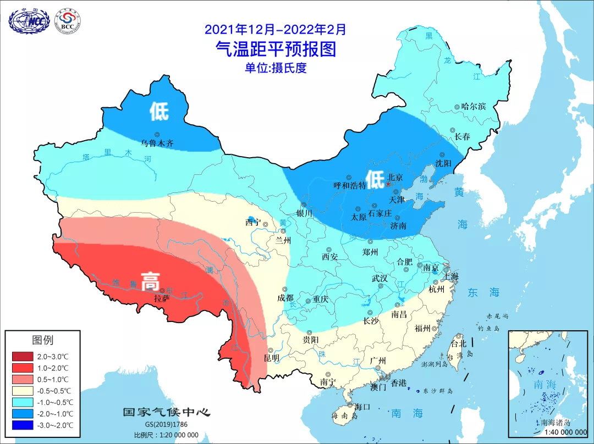

- **三维**：在三维空间中表达信息，即 xyz 三坐标系。
  - 以体（立方体、圆柱体）为主要元素，突出深度、体积和角度等。通过调整物体在三维空间中的位置、大小和形状，可以展示更多的空间关系和视角。
  - 非几何属性也同样适用于三维可视化，例如使用色彩和光照效果来模拟阴影和反射。三维可视化广泛应用于建筑设计、虚拟现实、游戏开发等领域。

- **四维**：通过动画（帧 + 时间）来记录和展示图形的变化。
  - 在时间维度上，通过连续的图形演变，可以呈现数据的变化趋势和演化过程。这种形式的可视化特别适用于展示时间序列数据和动态系统。
  - 例如，使用折线图或曲线图展示随时间变化的数据趋势，或者通过动画展示物体的运动轨迹和变形过程。

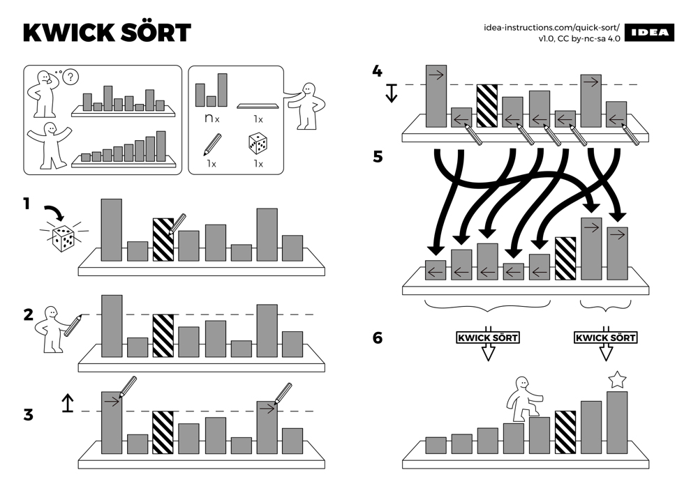

#### 图的表现力

图可以在一个相对小的空间中表达大量的信息，因而图传达信息的能力（表现力）远远超过了文字。

- 直观性：图形能够以直观的方式呈现信息，通过形状、颜色和位置等视觉元素传达信息，使人们更容易理解和记忆。相比之下，文字需要经过阅读和解释才能理解其含义。
- 综合性：图形可以在一个整体中呈现大量的信息，将复杂的概念和关系以一种清晰的方式展示出来。这有助于整合不同的观点和元素，帮助读者建立全局的认知和理解。
- 语义化：图形可以使用符号、图标和形状等视觉元素来表示特定的含义，从而实现语义化的表达。这样一来，读者可以通过视觉上的关联性来理解不同元素之间的关系，而无需依赖繁琐的文字解释。
- 空间表达：图形在空间上的布局和组织可以传达信息的层次结构和重要性。通过在图形中使用不同的位置、大小和层次，可以强调某些元素的重要性，帮助读者更好地理解和记忆信息。
- 跨文化性：图形在语言和文化之间具有更广泛的适应性。由于图形是基于视觉元素的，因此它们可以跨越语言障碍，使得信息在不同文化和语境中都能得到理解和传达。

**图本质上也是抽象的、符号化的，在绘制和阅读时同样会遇到理解差异、上下文负载等语言和文字限制。抽象程度越高，需要理解当前图像的上下文和背景知识就越多，如波形图、甘特图、UML 图等。**

因此绘图者不但要琢磨绘制的图形元素是否能够表达自己的想法，还要考虑读者是否具备足够的知识和能力来理解图形的含义。

## 如何绘制软件架构图

在软件开发领域，架构图是一种强大的工具，用于描述系统设计时的逻辑结构。类似于建筑设计中的建筑图纸，架构图可以帮助软件开发人员更好地理解和沟通系统的整体设计，从而促进团队合作和项目的成功实施。

因为父亲是一名建筑工程师，小时候在书房能经常看到各种设计图纸，一米多长的图纸上密密麻麻的线条和文字。在从事软件开发后，我也一直觉得软件工程和建筑工程是有很大相似性的，都需要多个部门、多个角色的协作，都需要在有限的条件下解决问题，都需要考虑安全因素，才能最终完成一个复杂的工程项目。软件开发过程中，也常将架构图作为协作的纽带，将不同的角色的工作内容、工作流程、标准规范等，以图形的方式表达出来，以便于大家理解和沟通。

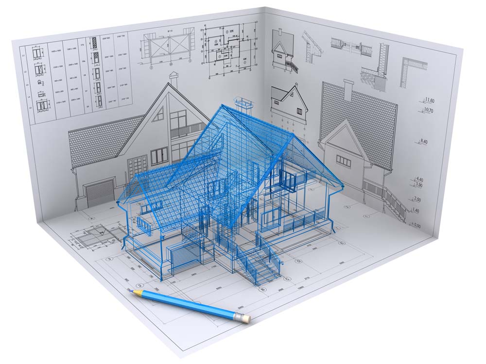

软件相比建筑会更加的灵活 —— 抽一个函数比抽一块砖的难度小多了。因此架构图还能够作为演进和后期规划的工具，帮助团队在系统演进过程中做出明智的决策。就像我在前言里提到的各种使用场景，架构图本质是**一种用来沟通的工具**，它能够帮助团队在不同的阶段和层次上理解系统，并在不同的角色之间促进更流畅的沟通 —— 这也是它的价值所在。

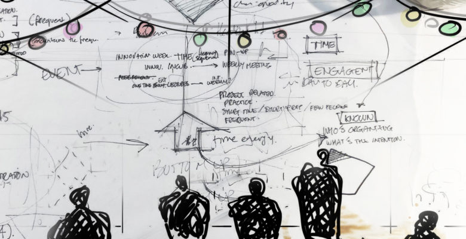

不论是哪种类型的架构图，它们的本质都是用来传递信息。那么**为了高效地传达信息，绘制架构图时首先要明确目标受众群体和信息主体，即“向谁传达什么信息”。**不同的受众可能对系统的不同方面有不同的关注点，因此在设计架构图时需要根据受众的角色和需求，选择合适的表现方式和细节层次。

### 明确目标受众

在软件开发和架构设计过程中，不同角色承担的职责不同，因此他们期望从架构图上获取的信息也不同。

#### 首席技术官（CTO）

场景：

- 战略决策：CTO 需要使用架构图来评估技术决策对业务目标的影响，为公司的技术战略提供指导。
- 技术沟通：CTO 利用架构图与其他高层管理人员共享技术信息，以支持业务决策和资源分配。

目的：

- 业务和技术对齐：架构图帮助 CTO 确保技术决策与公司的战略目标和需求保持一致。
- 资源规划：CTO 通过架构图了解系统的瓶颈和扩展性，从而做出合理的资源投资决策。

#### 产品经理（PM）

场景：

- 需求理解与验证：产品经理可以通过架构图了解系统如何满足用户需求，验证产品功能是否与预期一致。
- 产品规划与优先级：产品经理可以根据架构图了解各个模块的重要性和依赖关系，从而进行合理的产品规划和优先级设定。

目的：

- 用户期望管理：架构图能够帮助产品经理更好地理解系统能力，从而更准确地与用户沟通产品的期望和限制。
- 需求变更理解：架构图帮助产品经理了解修改需求如何影响整个系统，以便做出明智的需求调整决策。

#### 架构师

场景：

- 架构设计与演进：架构师需要创建初始架构设计以满足业务需求，并在系统演进过程中进行架构优化和重构。
- 系统整体视图：架构师可以使用架构图来展示整个系统的组件、模块和关系，以便更好地理解系统。

目的：

- 技术决策支持：通过架构图，架构师能够评估不同的技术选项，从而做出明智的技术决策。
- 团队沟通：架构师可以利用架构图向开发团队和非技术团队解释设计决策，协调不同团队之间的合作。

#### 开发工程师

场景：

- 开发指导：开发工程师根据架构图中的指导，编写、测试和维护系统的不同模块和组件。
- 跨模块理解：开发工程师可以查看架构图，了解自己的模块如何与其他模块互操作，从而更好地集成系统。

目的：

- 代码一致性：架构图可以确保开发团队按照相同的结构和设计来构建系统，提高代码的一致性和可维护性。
- 减少集成问题：开发工程师通过架构图了解模块之间的交互，有助于减少集成阶段的问题和冲突。

#### 技术顾问（Advisor）

场景：

- 技术评估和建议：技术顾问通过架构图对现有系统进行评估，提供技术改进建议和优化方案。
- 新项目咨询：在新项目启动阶段，技术顾问可以协助客户绘制架构图，指导技术选择，并阐述项目可行性。
- 解决问题和疑难情况：在面临技术难题、性能问题或安全漏洞时，技术顾问可以利用架构图进行分析和解决方案制定。

目的：

- 技术指导：通过架构图，技术顾问可以向客户阐明系统的强项和改进的空间，为技术决策提供明智的建议。
- 风险识别与规避：技术顾问利用架构图帮助客户识别潜在风险和漏洞，提前规避可能的问题。
- 战略规划：通过绘制架构图，技术顾问可以帮助客户规划长期技术战略，以支持业务目标的实现。

### 关注点设立

在理解了不同角色的需求后，我们可以根据不同的关注点设立架构图的目标，以便更好地传达信息。我们将其分为两个方面：

**利益相关方**，即谁应该关注当前的架构图，以及他们关注的是什么。利益相关方可以是项目团队的成员，也可以是项目外的其他人员，如客户、投资人等。

| 角色（示例） | 关注点                                                       |
| :----------- | :----------------------------------------------------------- |
| 业务人员     | 主要关注业务模块、业务流程和系统边界等                       |
| 开发人员     | 主要关注系统的组件、模块和接口等                             |
| 系统管理员   | 主要关注系统的部署、运行和监控等                             |
| 架构师       | 主要关注系统的整体设计、问题和优化方向，以及未来的演进规划等 |
| 项目经理     | 主要关注系统的边界，团队资源和成本                           |
| CxO          | 主要关注业务领域、组织结构的映射                             |

**信息主体**，即当前架构图想要表达的核心概念是什么。信息主体可以是业务领域、业务用例、系统、系统模块、基础设施等。

| 主体（示例） | 描述                                             |
| :----------- | :----------------------------------------------- |
| 业务领域     | 比如，销售、采购、库存、财务等                   |
| 业务用例     | 比如，采购领域中的采购申请、采购订单、采购入库等 |
| 系统         | 比如，采购系统、库存系统、财务系统等             |
| 系统模块     | 比如，采购系统中的支付模块、订单模块等           |
| 基础设施     | 比如，服务器、网络、数据库等                     |
| 进程间架构   | 比如，系统模块间的调用关系、数据流等             |
| 进程内架构   | 比如，系统模块内的接口、包、分层等               |

信息主体和利益相关方很多时候是有关联关系的，某一些角色会相对固定的关注某一些信息主体。因此，便形成一些可复用的、模式化的架构图，可以帮助团队更好地理解和沟通系统。

### 传递可视化信息

**结构层次分解**，分析信息主体，按整体和部分的顺序分解为不同的层次，并添加细节。

- 分解系统：将系统分解为不同的层次或模块。如，前台、中台、后台，或者业务层、数据层、基础层等。
- 使用容器：使用容器限定系统或层次的边界。
- 显式化层次：使用适当的符号（颜色、线段、形状）来区别不同层次。
- 细化职责和功能：为在每个层次的模块，添加其职责和功能的描述。
- 避免过度细节：保持适度的抽象避免加入过多细节。

**逻辑关系组织**，添加更多细节，调整和突出层次、模块间的逻辑关系。

- 使用合适的布局：选择合适的布局增强可读性和美观性。如层次布局、流程图布局、网格布局等。
- 显示化依赖关系：使用适当的符号或线条来表示组件之间的依赖关系。如消息传递、调用关系、数据流等。
- 强调关键组件：如果系统中存在关键的组件或模块，可以将其放置在显著的位置，并突出显示。
- 添加标签和注释：添加适当的标签、注释和说明。

**风格和风格指南**，形成可复用的、模式化的架构图。

在软件开发发展的这些年，已经有一些比较成熟的架构图风格：

- 统一建模语言（Unified Modeling Language，UML）是一种用于软件系统分析和设计的标准化建模语言。它提供了一套丰富的图形符号，用于表示系统的结构、行为和交互。UML 通常用于面向对象的系统设计，但也可以用于其他类型的系统设计。UML 的图形符号包括类图、对象图、组件图、部署图、活动图、时序图等。
- AWS 架构图，由亚马逊云服务（Amazon Web Services，AWS）提供的一套用于描述和展示云架构的图形符号。AWS 架构图包括了大量的图形符号，用于表示云服务、网络、存储、数据库、安全、分析等方面的内容。AWS 架构图通常用于描述和展示基于 AWS 云服务的系统架构。
- 网络拓扑图，用于描述和展示网络拓扑的图形符号。网络拓扑图通常用于描述和展示网络的结构、组件、设备和连接关系等。网络拓扑图通常用于描述和展示网络的结构、组件、设备和连接关系等。
- C4 模型，由 Simon Brown 提出的一种用于描述和展示软件系统架构的模型。C4 模型包括了多种图形符号，用于表示系统的上下文、容器、组件和代码等。C4 模型通常用于描述和展示软件系统的整体结构和组织方式。

与此同时，作为架构图的绘制者（个人或是项目团队）应该掌握和复用已有的架构图风格，减少信息差便于大家对齐理解。如果现有风格不满足需求的情况下，也可以建立自己的架构图风格 —— 不是随意的拖拽、堆砌一些图形和文字，而是构建标准的绘制手法、保持稳定的图形输出，以便具有相同上下文的利益相关方能够快速理解：

- 遵循标准和规范：不同的风格通常都有相应的标准和规范，这些标准和规范定义了符号的含义、连接方式、布局等要求。在绘制架构图时，应该遵循相应的标准和规范，以确保图形的一致性和易读性。
- 选择适合的风格：根据具体的需求和受众群体选择适合的风格。例如，如果要与开发团队共享架构图，可以选择使用UML标准，因为UML是一种通用的建模语言，被广泛接受和理解。如果要绘制云平台相关的架构图，可以参考AWS架构图风格，以便更好地与AWS服务和工具集成。
- 保持一致性：在整个架构图中保持一致的风格和符号使用，避免混淆和误解。使用相同的符号表示相同的概念或组件，使用相似的线条和布局方式来表示关系和连接。

**使用合适的图形工具**：以确保可以满足所选风格和规范的要求。也可根据个人偏好选择适合的工具，逐渐形成自己的使用习惯。

软件系统相比建筑物来说，其生命周期要短的多，并且需要持续不断的演进和迭代。绘制架构图也需要选择合适的工具，以适应系统的快速变化和演进。如果只是为了简述和讨论，那么使用白板和笔就足够了。如果需要长期保存和维护，那么可以选择一些在线绘图工具。当前这些工具都非常成熟，并且同类产品很多，这里只分享几个笔者常用的工具：

- Excalidraw
- Draw.io
- Jamboard
- PPT (slides, keynote)
- plantuml
- dbdiagram
- mermaid

## Mesh-Shaped 架构视图

综上所述，架构图是

> 即 \
> -> 针对 “利益相关方” 选定合适的 “信息主体” 用于传达某种信息；\
> -> 进行 “结构层次分解” 并按 ”逻辑关系组织” 分解出的元素；\
> -> 按照 ”风格” 调整和添加一些细节 —— 我们就能绘制出一张简明扼要的架构图。

然而，在构建复杂的软件系统时，常常需要多个角色通力合作并进行信息交换。就像是建筑设计中的平面图、立面图、剖面图等，分别描绘的不同视角下建筑物的某项功能和特点，但组合起来才能构建完整的建筑。类似的，在软件开发中我们也有这样一系列的、具有明确职责的、但又相互关联的架构图。比如：

- UML 包含了多种类型的架构图，如类图、对象图、组件图、部署图、活动图、时序图等。
- C4 模型则包含了系统的上下文视图、容器视图、组件视图和代码视图等。
- “4+1” 提出了逻辑视图、过程视图、物理视图、开发视图和场景视图。通过多个相互关联的架构图，对软件系统进行不同维度的描述。

上文提到，架构图使用图形元素作为抽象符号来表达信息，依然会出现上下文依赖和信息过载的问题。因此，绘制架构图时需要考量当前架构图的信息边界，不宜在一张架构图中表达过多的信息。此时，可以通过绘制多张架构图来描述未包含的信息，比如背景、上下文、细节实现。

> 那如何组织这些架构图？既能保证信息传递的完整性和一致性，又最大限度减少冗余呢？

### 结构层次分解

基于过往的经验和 4+1、C4 等工具的使用，我总结了一个架构视图矩阵，用于组织和描述软件系统的不同视图。其核心还是关注点设立：**利益相关方**和**信息主体**。对于较为成熟的软件开发模式/团队来说，利益相关方和信息主体变动不大，因此可以将他们的关系固化下来：

**视图层次**，信息主体所处的层次或者说类别。是表达概念为主，还是实际产物为主。

- **概念视图**：静态视图，描绘关键概念 -> 统一语言和概念
  - 目的：统一团队对项目核心概念和术语的理解。
  - 内容：包括项目的愿景、目标、核心价值主张、用户需求等。
  - 方法：通过工作坊、头脑风暴会议和概念图来定义和共享关键概念。
- **模块视图**：静态视图，描绘层级关系 -> 大小、包含、接触、交界
  - 目的：展示系统的结构化层级和模块化设计。
  - 内容：包括系统的各个模块、组件及其相互关系。
  - 方法：使用UML图、架构图和模块图来描述系统的静态结构。
- **实现视图**：静态视图，描绘某一个时间点的产物 -> 等价交付物
  - 目的：描述在特定时间点的系统实现状态。
  - 内容：包括代码库、数据库架构、API接口等具体的实现细节。
  - 方法：通过代码审查、技术文档和部署图来展示系统的实现状态。
- **动态视图**：动态视图，描绘依赖关系和时间轴上的先后顺序 -> 前置后驱
  - 目的：展示系统的动态行为，包括依赖关系和时间轴上的先后顺序。
  - 内容：包括系统的工作流程、数据流、用户交互流程等。
  - 方法：使用流程图、状态图和时序图来描述系统的动态行为。

**利益相关方层次**，当前架构图的主要关注者。但不代表其他人不关注这些信息，只是关注程度不同。

- **管理**（CxO，PM）：产品/项目的领导者，关注愿景、方向、价值
  - 关注点：产品的长期愿景、战略方向和商业价值。
  - 需求：需要高层次的业务视图，包括市场分析、竞争分析和ROI预测。
  - 沟通方式：定期的战略会议和高层汇报，以及关键里程碑的更新。
- **产品**（PO，BA）：产品设计者，通过功能设计实现价值
  - 关注点：产品的功能设计、用户体验和市场定位。
  - 需求：需要详细的产品需求文档、用户故事和原型设计。
  - 沟通方式：产品评审会议、用户反馈会议和敏捷迭代计划。
- **架构**（Arch）：架构师，关注 CFR 和系统设计
  - 关注点：系统的可扩展性、性能、安全性和可靠性。
  - 需求：需要系统架构图、技术选型文档和性能测试报告。
  - 沟通方式：架构评审会议、技术研讨会和代码规范。
- **研发**（TL，Dev）：工程师，进行业务功能在系统上的实现
  - 关注点：代码的质量和系统的可维护性。
  - 需求：需要具体的开发指南、代码规范和自动化测试脚本。
  - 沟通方式：代码审查会议、技术分享会和每日站会。

因此，我们可以绘制出以下的矩阵 —— 不同角色（利益相关者）对应到不同视图层次所期望获得的信息主体。

<!-- 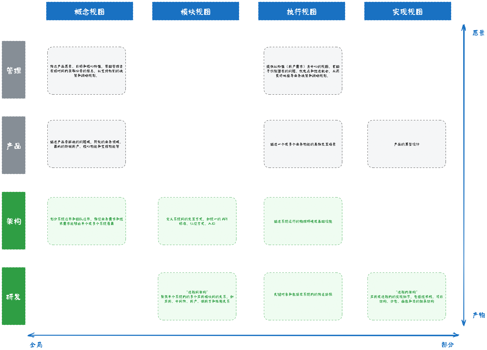 -->

#### 隐含的层次

因为组织的规模不同，同样的角色可能代表不同的职责范围。比如，世界 500 强的 CTO 和创业公司的 CTO 关注点是不同的，传统行业研发的架构师和互联网研发的架构师职责也不尽相同。为了避免深入到组织架构的讨论，这里的角色限于负责单一“软件产品”的团队内。

**软件产品层次**，限定本视图对产品、系统、应用的讨论范围。

同样是软件产品，一个图书馆管理系统和抖音的规模是完全不同的，技术架构、系统设计、组织结构和团队规模都是完全不同的。类似抖音的 SuperApp 更像是一个包含多个产品的门户，如直播、商业、短视频、社交。每个产品又由若干个系统组成，如评论系统、弹幕系统、礼物系统，每个系统又有多个微服务和中间件构成。

> 复杂度低，应用 ≈ 系统 ≈ 产品 \
> 复杂度高，应用 < 系统 < 产品

因此，越复杂的产品绘制出的架构视图也越复杂，甚至可能交叉，如多个产品团队实现同一个愿景，多个技术化团队支持同一个产品。为了方便理清本文中架构图的信息边界，这里先对我们所讨论的软件产品下一个笼统的、仅供参考的定义。

- 应用：在单个进程或 Pod 内运行的程序，用于提供 API 调用。也可以是中间件和封装好的 API 接口。
- 系统：由一个或多个应用组成，用于提供特定业务功能。
- 产品：由一个或多个系统组成，用于提供特定的行业价值。

另一个隐含的层次是生命周期，各个视图的出现的时机和修改频率是不一样的，你不会频繁的修改你的愿景，但你却需要时刻关注项目进度。

**产品生命周期**，描述软件产品的整个生命周期，从概念到实现再到维护。

- 设计：如何根据用户需求设计产品的功能和界面，并确定技术选型。
- 开发：如何根据设计文档实现产品的功能和界面，并进行测试和部署。
- 运维：如何根据用户反馈和运行数据优化产品的功能和性能，并进行维护和升级。

### 逻辑关系组织

接下来，我们要为架构图添加依赖关系，以突出不同关注点间的逻辑关系。

#### 设计阶段

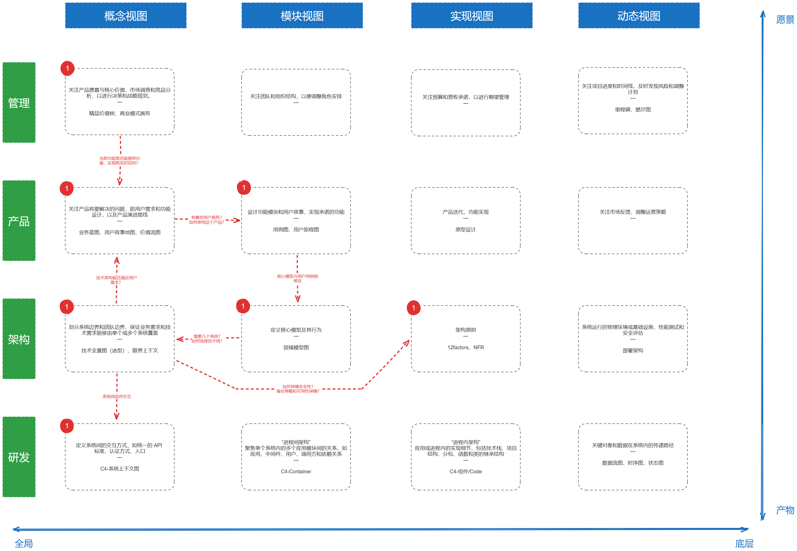

设计阶段的核心是产品设计和系统设计：

- 产品需要根据用户需求和市场定位确定产品的功能 （产品x概念）
- 产品需要和管理层沟通产品的愿景和战略方向（管理x概念）
  - 产品的愿景和战略方向是否符合公司的战略目标？
  - 产品的功能是否能提供用户价值？
  - 产品的盈利模式是否可行？
  - 愿景是否调整？
- 产品需要根据用户需求设计出产品的功能和界面（产品x模块）
  - 产品的功能是否满足用户需求？
  - 产品的界面是否符合用户习惯？
  - 产品的交互是否流畅？
- 产品需要和架构师沟通设计领域模型（架构x模块）
- 架构师需要根据产品的功能设计系统的架构（架构x概念）
  - 技术选型是否满足产品的需求？
  - 核心数据结构是否合理？
  - 数据如何流转？
- 架构师需要根据技术选型列出NFR（架构x实现）
- 架构师需要和开发团队沟通确定系统职责（研发x概念）

> 可以看到，这些视图形成了一个反馈链，任何一个“架构”的修改，都可能引发其他架构的调整。如愿景的调整会增加或裁剪产品功能，架构设计时发现遗漏或是无法实现的功能。

<!-- 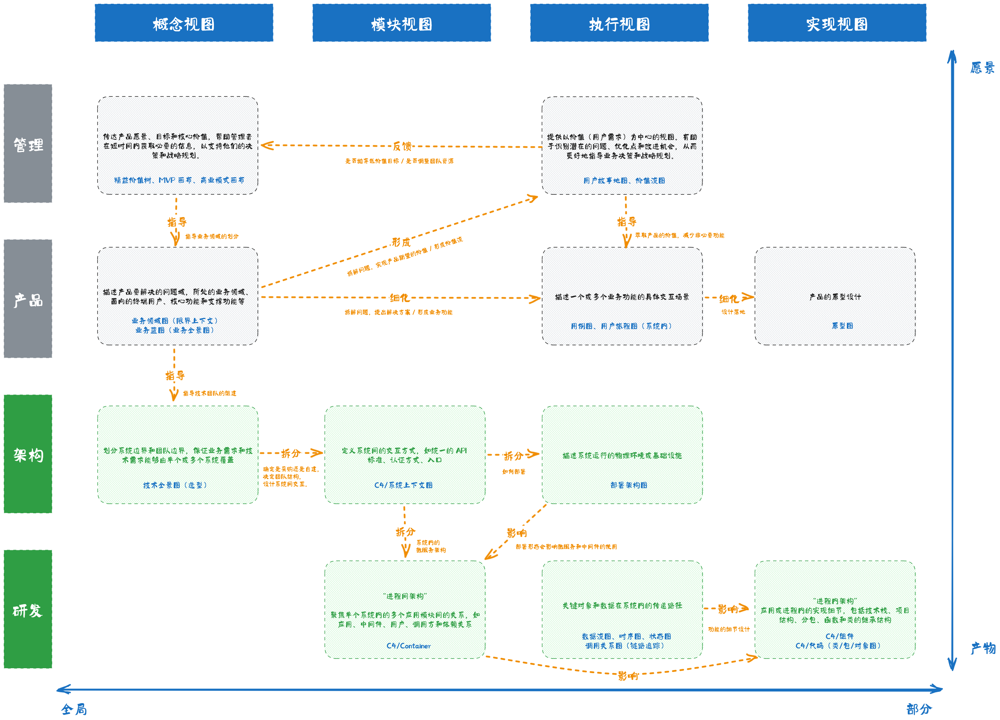 -->

#### 开发阶段

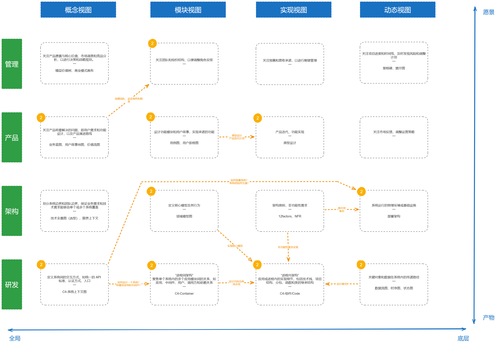

之后我们便进入开发周期:

- 管理根据产品规划的功能划分团队（管理x模块）
- 产品根据用户需求设计原型图（产品x模块）
- 研发根据产品设计和技术框架实现功能（研发-）

#### 运维阶段

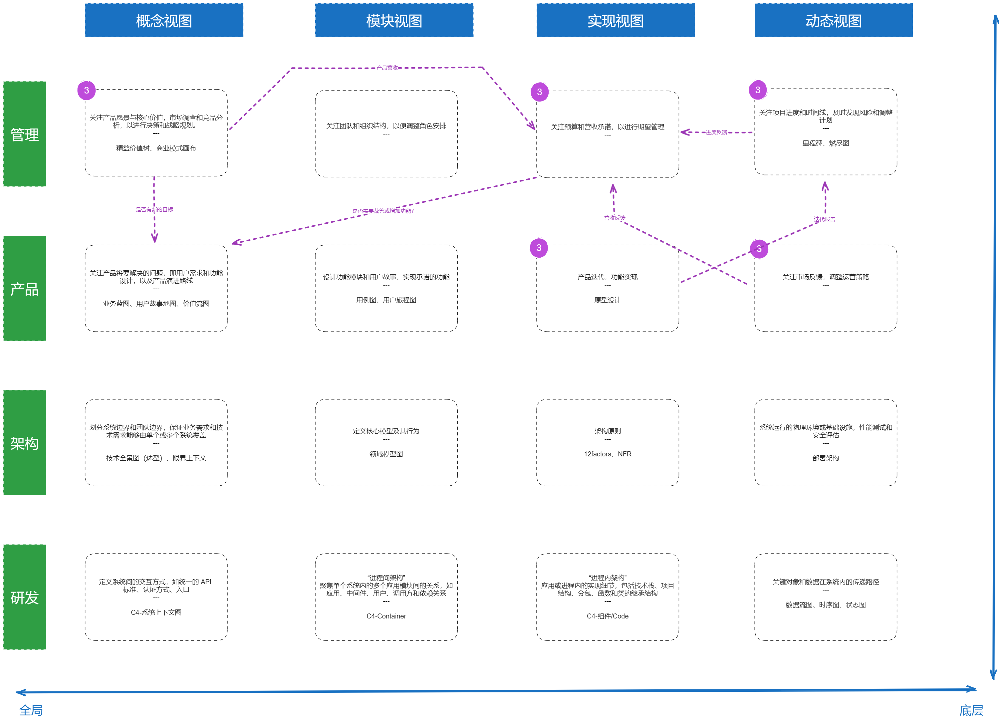

软件具有第一个可发布版本后，我们便进入运维阶段：

- 产品需要关注运营指标和用户反馈（产品x动态）
  - 是否调整运营策略？
  - 产品功能是否满足用户需求？
- 管理需要关注迭代计划（管理x动态）
  - 项目进度是否符合计划？
  - 是否需要调整团队资源？
- 管理需要关注营收和预算（管理x实现）
  - 项目的成本是否控制在预算内？
- 管理需要适时调整愿景（管理x概念）
  - 是否有新的商业机会？
  - 是否有新的竞争对手？
  - 营收目标是否达成？

> 上述阶段可以同时存在，特别是在产品的初期，需要快速的迭代和验证产品的功能和用户需求。因此，在快速迭代的团队，如何及时的同步信息，是非常重要的。
>
> 同时，每一个角色都要明白，你的产出对其他角色的工作有什么影响，如何协作和沟通。否则就会出现，管理层修改愿景却不留给产品足够的时间去调整功能，产品设计了暂无法实现的功能又不留给架构师调整架构的时间，最后导致团队无法按时交付，质量低，用户反馈差。

### 风格（示例补充）

最后，整个团队使用相同的设计语言（颜色、字体、线条、形状）来绘制架构图，以确保图形的一致性和易读性。以一个智能物业系统为例... （随便想的一个例子，主要看图）

- 精益价值树
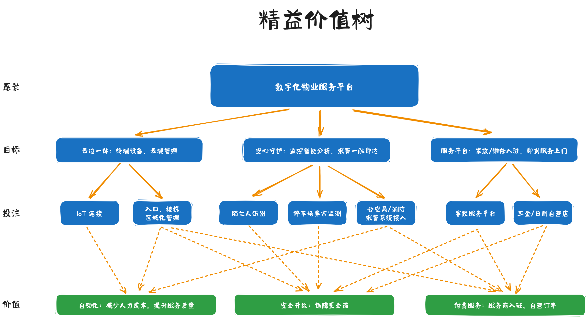

- 价值流图
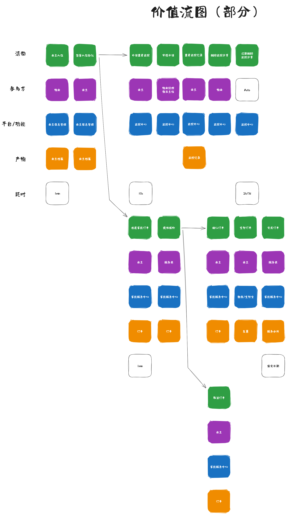

- 业务全景图
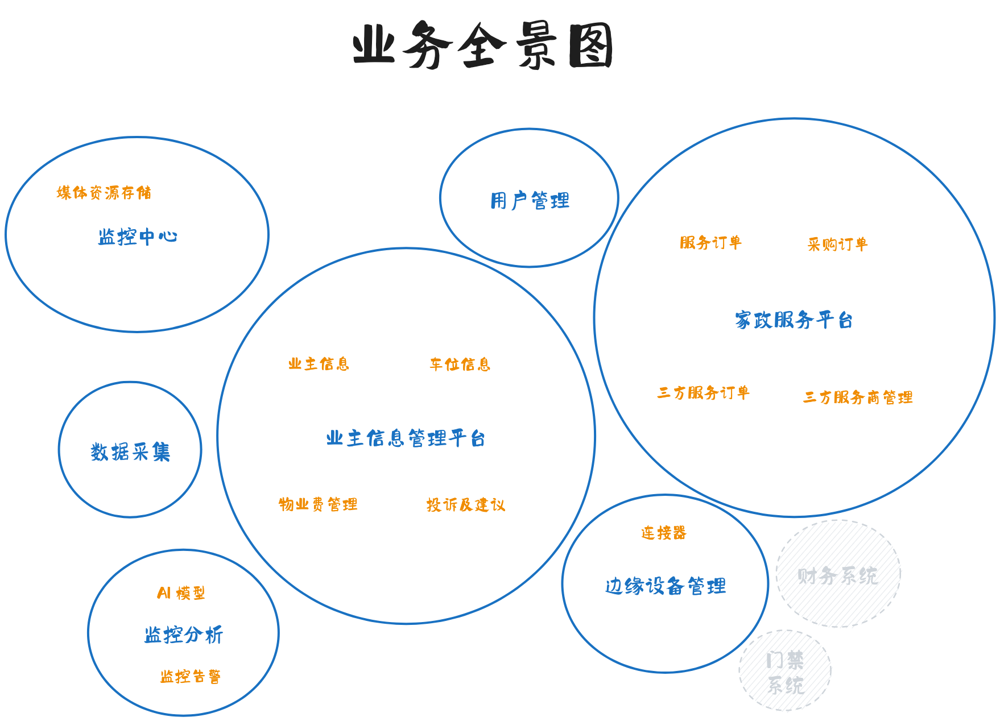

- 技术全景图
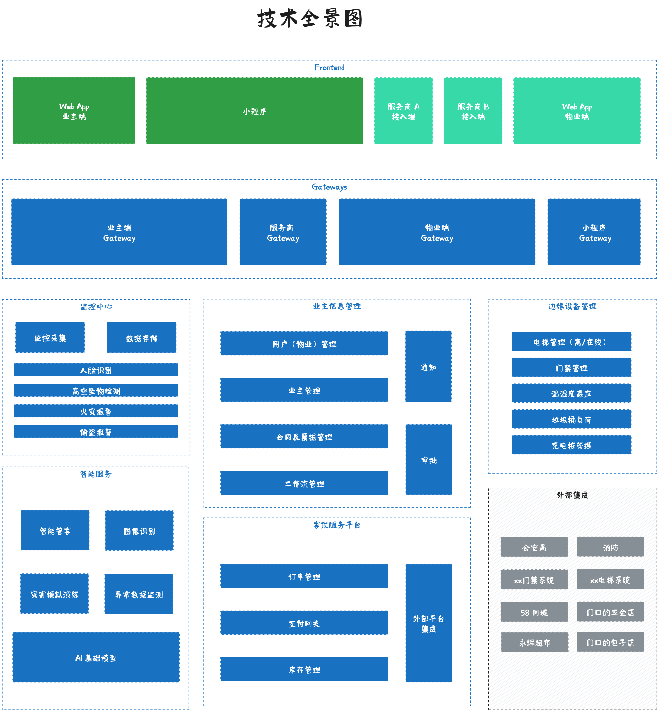

- 系统上下文 (C4/Context)
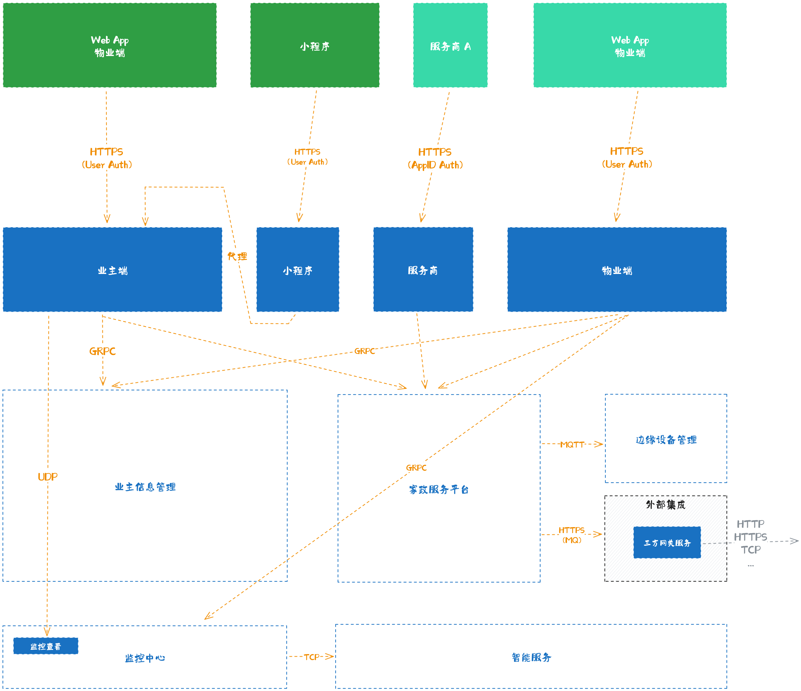

- DevOps 价值流图
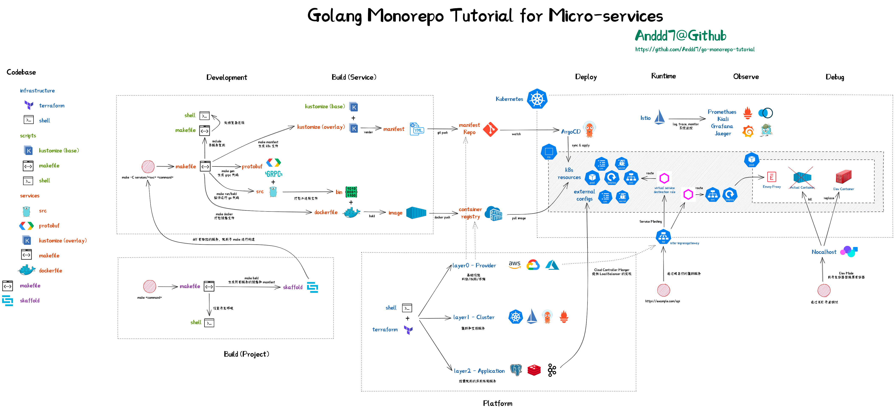

- Infra 部署图
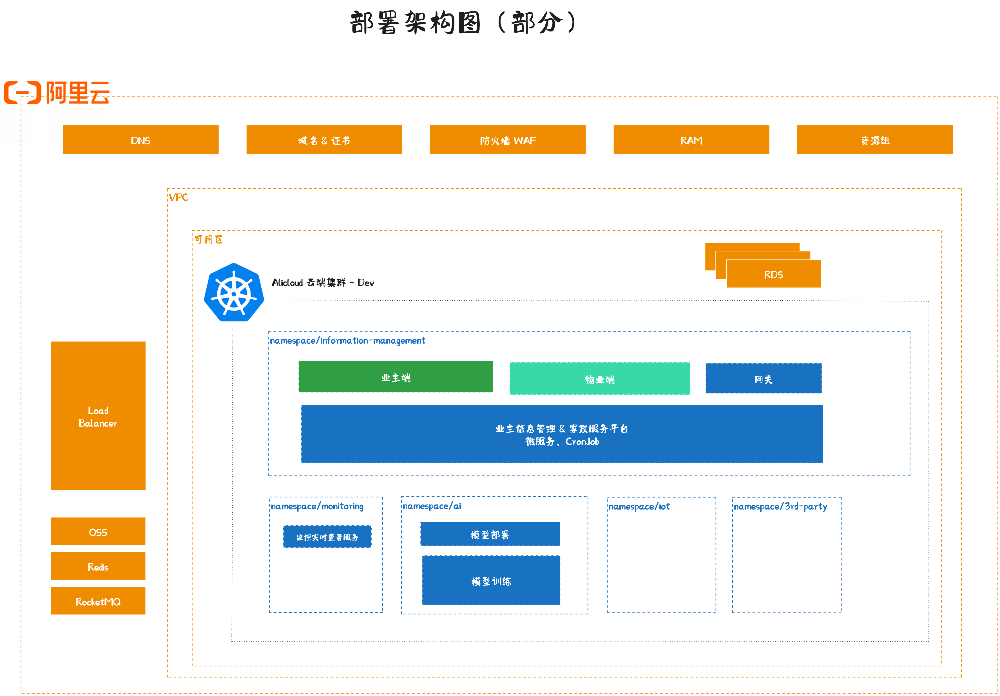

- 进程间架构 (C4/Container)

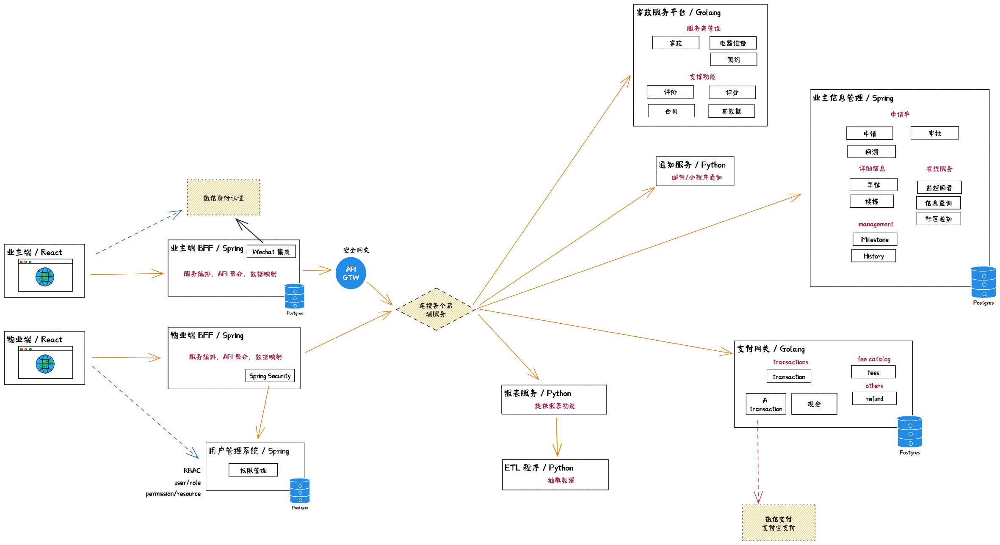

- 进程内架构

> 进程内架构则是我们熟悉的代码设计了，可以是类图、对象图，也可以是一个功能的具体设计，主要是目的是描述代码实现的逻辑结构。

## 总结

> 画架构图的目的是为了沟通，而不是为了画图而画图。

不论是哪种类型的架构图，它们的本质都是用来传递信息。**为了高效地传达信息，绘制架构图时首先要明确目标受众群体和信息主体，即“向谁传达什么信息”。**

熟悉信息主体（部署情况、服务依赖关系、代码结构、数据流向），了解利益相关者（老板、业务 PO、技术 Leader、测试工程师），之后再考虑你应该绘制怎样的一张架构图。
